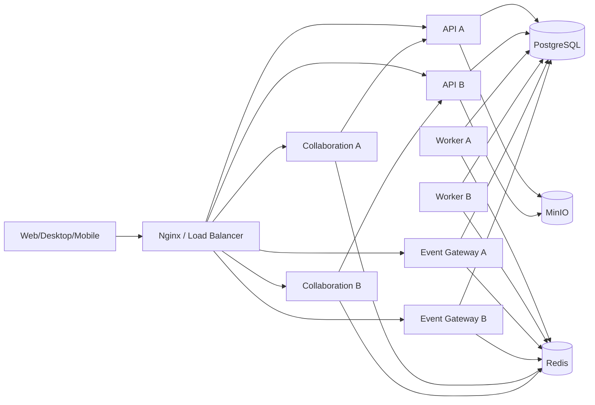

# 模块化单体与独立运行组件目标架构提案

## 1. 文档定位

本文是未激活的 `PLATFORM-SCALE` 目标架构提案。它不代表当前已经实现，也不改变 `PROJECT-PLATFORM-S04` 的目标架构、路线或完成状态。

S04 完成并合入主干后，必须基于干净主干复验源基线；只有专项被正式激活时，本文才能提升为 `status: target`，并与 Program、专项索引和当前路线使用相同修订号。

## 2. 目标

把 Colla Platform 演进为：

1. 一个具有自动边界门禁的业务模块化单体。
2. 可水平增加实例的无状态 HTTP API。
3. 可独立增加实例的异步 Worker。
4. 可独立增加实例的通用实时事件网关。
5. 继续独立运行和扩容的 Hocuspocus/Yjs 知识协同组件。
6. 共享 PostgreSQL、Redis 和 MinIO 的单企业部署基线。

“独立运行组件”不等于业务微服务。API、Worker 和通用实时网关第一阶段继续使用同一 Server 源码和构建产物，通过运行角色选择 Bean、端口和职责。

## 3. 非目标

本专项不以以下事项作为完成条件：

- 不拆分前后端仓库。
- 不把 15 个业务模块拆成 15 个服务。
- 不为每个模块建立独立数据库。
- 不引入 Kafka 作为前置条件。
- 不要求 Kubernetes 或自动扩缩容。
- 不删除共享数据库中的 workspace/user 外键。
- 不重写 Hocuspocus/Yjs 协同协议。
- 不顺带重做 PROJECT-PLATFORM 的字段、布局、发布或工作项产品能力。
- 不承诺 PostgreSQL、Redis、MinIO 的集群高可用；先交付应用层横向能力和可恢复基线。

## 4. 目标拓扑



PostgreSQL 是业务事实、outbox 和协同 durable update 的事实源。Redis 只承担瞬时广播、presence、协调和有限的短生命周期状态；Redis 消息不得成为唯一业务事实。

## 5. 运行角色

| 角色 | 主要职责 | 明确禁止 | 独立扩容依据 |
| --- | --- | --- | --- |
| `api` | HTTP API、事务命令、查询、outbox append、文件访问 | 不执行事件轮询；不保存通用 WS session；不运行旧知识协同定时任务 | HTTP RPS、延迟、连接池和 CPU |
| `worker` | claim outbox、执行业务 handler、增量索引、通知落库、重试/replay | 不接受用户业务 HTTP；不持有 WebSocket session | backlog、oldest age、handler latency |
| `event-gateway` | `/ws/events`、本地 session、Redis fanout、重连校准 | 不执行业务写事务；不直接操作业务模块 Repository | WebSocket connection、fanout rate、内存 |
| `collaboration` | Hocuspocus/Yjs 房间、awareness、Redis 协同、durable update gateway | 不承担 IM/通知通用事件；不复制知识权限事实 | 活跃房间、编辑连接、更新速率 |
| `migration/maintenance` | 显式迁移、修复和一次性维护命令 | 不在每个 API 实例启动时隐式执行大规模业务迁移 | 运维计划和审计 |

运行角色必须通过显式配置激活，默认生产配置不能同时悄悄启用 API、Worker 和旧协同定时任务。

## 6. 模块边界

### 6.1 允许依赖

业务模块只能依赖：

1. 自身 api/application/domain/infrastructure。
2. `shared` 中不含业务语义的技术原语。
3. 其他模块显式发布的 `contract`。

推荐增加：

```text
com.colla.platform.modules.<module>.contract
```

该包只包含：

- 跨模块 facade 接口。
- 输入输出 record。
- 稳定标识和值对象。
- 领域事件合同。
- SPI。

合同实现留在 provider 的 application/infrastructure 内。HTTP Controller DTO 不自动成为内部模块合同。

### 6.2 禁止依赖

- 任何模块 import 其他模块的 `infrastructure`。
- 任何模块 import 其他模块的 Controller 或 HTTP DTO。
- `shared` import 任一业务模块。
- 组合页面服务直接拼装多个模块 Repository。
- 业务命令直接更新其他 owner 的表。
- 新代码通过添加全局 helper 隐藏跨模块依赖。

### 6.3 组合模块

`workspace` 和 `admin` 可以编排多个模块的 query facade，但不能直接依赖其 Repository。组合模块不拥有来源业务事实，也不能开启跨 owner 写事务。

### 6.4 平台对象

平台对象采用反向 SPI：

- `platform.contract` 定义 resolver SPI 和权限安全摘要。
- 业务模块实现 resolver。
- registry 通过 Spring 发现实现。
- platform application 不 import 具体业务模块。

### 6.5 权限解析

权限模块通过合同解析主体和资源：

- `SubjectDirectory`：用户、部门、用户组的最小状态。
- `ResourceDescriptorProvider`：资源存在性、workspace、owner 和可披露状态。
- `PermissionDecision`：允许、拒绝、隐藏和解释。

权限模块不能读取 knowledge/project/Base 私表来猜测资源语义；资源模块也不能直接写 `resource_permissions`。

## 7. 自动门禁

### 7.1 后端

采用 ArchUnit 作为第一阶段门禁：

- 禁止 foreign infrastructure import。
- 禁止 shared -> modules。
- 限制 module -> foreign contract。
- 检查 contract 不依赖 provider infrastructure。
- 输出模块有向图和强连通分量。

现有违规进入带 owner、原因、退出 Stage 和截止条件的 baseline allowlist。门禁允许历史基线存在，但任何新增违规立即失败；触及旧违规的改动必须减少或保持，不得扩大。

Spring Modulith 可以在循环依赖显著减少后再评估，不作为 S01 前置。

### 7.2 前端

使用 TypeScript AST 和 tsconfig 路径解析：

- feature 只从其他 feature 的 public entry import。
- 禁止跨 feature 深路径。
- 页面路由继续懒加载。
- app shell 可以组合 feature public entry。
- shared 不能 import feature。

### 7.3 数据

维护机器可读 table owner 清单，并组合：

- SQL token 静态扫描。
- Repository ownership 检查。
- Testcontainers 数据隔离和权限测试。
- 人工复核动态 SQL。

静态正则只能作为候选发现器，不能作为唯一完成证据。

## 8. 数据边界

### 8.1 共享数据库

第一阶段继续：

- 一个 PostgreSQL 数据库。
- 一个 Flyway 迁移链。
- 一个业务 schema。
- workspace/user 复合边界和外键。

模块化边界不等于物理 schema 拆分。

### 8.2 写入规则

- 每张业务表只有一个 owner。
- 只有 owner Repository 可以修改该表。
- 其他模块通过 command facade 或异步事件请求变化。
- 组合查询不得借机写入来源表。
- 跨模块批量业务操作使用显式流程协调器，记录每一步、补偿和最终状态。

离职交接应从一个 identity 本地事务改为可恢复流程：

1. identity 冻结待离职成员并创建交接流程。
2. knowledge、IM、project 分别执行 owner 交接。
3. 每步幂等并记录状态。
4. 全部完成后禁用成员。
5. 失败可以重试或人工介入，不留下无法解释的半完成事务。

### 8.3 读取规则

- 业务详情由 owner query facade 提供。
- 批量展示身份通过 directory batch query。
- 搜索维护自己的 `search_index_entries` 投影。
- 企业治理使用专用治理投影或多个 query facade。
- 暂时保留的 search/admin 私表只读例外必须可枚举、可观测且有退出 Stage。

## 9. 异步模型

### 9.1 交付语义

采用 PostgreSQL transactional outbox 和 at-least-once delivery：

- 不声称 exactly once。
- handler 必须按 event ID 或业务 dedupe key 幂等。
- 业务事务只 append event，不同步调用异步消费者。

### 9.2 事件合同

目标 envelope 至少包括：

- `eventId`
- `eventType`
- `eventVersion`
- `workspaceId`
- `aggregateType`
- `aggregateId`
- `actorId`
- `occurredAt`
- `correlationId`
- `causationId`
- `idempotencyKey`
- `payload`

事件 payload 不泄露密码、token、文件密钥或隐藏资源标题。

### 9.3 Claim 和恢复

事件状态至少支持：

- `pending`
- `processing`
- `processed`
- `dead_letter`

processing 增加：

- `claimed_at`
- `lease_until`
- `worker_id`
- `attempt_count`

超时 lease 可以安全回收。达到最大重试后进入 dead letter，由受权限保护的运维命令检查和 replay。

### 9.4 Handler

Worker 通过 handler registry 按 event type/version 分派：

- Notification handler。
- Search projection handler。
- Realtime signal publisher。
- 后续 automation/webhook handler。

单个 handler 失败不能阻止无关事件永久推进；需要明确是否按 aggregate 有序。

### 9.5 Search

搜索从 workspace 全量 refresh 迁移为：

- owner 事件携带可安全索引的变化标识。
- Search handler 按对象增量 upsert/delete。
- 重建索引是显式维护操作。
- 权限过滤仍以当前权限事实为准，不把过时标题或 ACL 快照当授权依据。

## 10. 通用实时事件

### 10.1 Gateway

`event-gateway` 保存自身节点上的 WebSocket session，并订阅 Redis pub/sub。每个 gateway 节点都接收面向用户或 workspace 的瞬时信号，再只向本地 session 推送。

Redis pub/sub 可以用于通用事件，因为：

- 通知、消息、项目和权限的数据库记录是事实源。
- 客户端连接或重连后必须通过 REST 获取未读数、最新消息和对象状态。
- WebSocket 是低延迟失效通知，不是唯一交付记录。

### 10.2 客户端恢复

每类事件必须定义：

- 推送 payload 的最小字段。
- 可用于去重或比较的 sequence/version。
- 重连后调用的 REST 校准接口。
- 无权限或资源删除后的安全降级。

Gateway 节点退出时，客户端重连到其他节点并执行校准，不依赖粘性会话恢复事实。

### 10.3 知识协同

Hocuspocus/Yjs 保持独立链路：

- Redis 负责跨节点广播和 awareness。
- PostgreSQL snapshot/update 是 durable source。
- Spring 只提供权限 ticket、load/store/invalidate gateway。
- 旧 Spring room/presence/autosave 链路经过观测后退出。

## 11. 观测和运维

每个运行角色必须提供独立 health/readiness 和标签：

### API

- RPS、P50/P95/P99。
- 4xx/5xx。
- DB pool 使用率。
- 外部依赖延迟。
- request/correlation ID。

### Worker

- pending 数量。
- oldest pending age。
- processing 数量和过期 lease。
- handler success/failure/retry/dead-letter。
- 每类事件处理延迟。

### Event Gateway

- 当前连接数。
- 每秒 fanout。
- Redis 状态。
- 发送失败和慢客户端。
- 重连和校准次数。

### Collaboration

继续保留现有 node、room、connection、watermark、pending update、persistence latency、recovery 和 Redis 指标。

## 12. 容量验收草案

以下是规划用 `C1` 验证负载，不是当前容量承诺。激活最终容量 Stage 前必须冻结硬件、容器限制、数据库参数、数据分布和负载脚本。

### 12.1 候选 C1 负载

| 指标 | 候选值 |
| --- | ---: |
| 注册成员 | 2,000 |
| 同时在线成员 | 500 |
| 混合 HTTP 持续负载 | 150 RPS |
| `/ws/events` 长连接 | 1,000 |
| 同时知识协同客户端 | 100 |
| 活跃协同房间 | 至少 25 |
| 异步持续写入 | 30 events/s |
| 异步五分钟突发 | 150 events/s |
| 工作项数据 | 1,000,000 |
| 知识内容节点 | 100,000 |
| 知识内容块 | 1,000,000 |

### 12.2 候选服务指标

| 指标 | 候选门槛 |
| --- | --- |
| HTTP read P95 | 不高于 300 ms |
| HTTP write P95 | 不高于 500 ms |
| 非预期 5xx | 低于 0.5% |
| 通用实时 fanout P95 | 不高于 1 s |
| WS 重连并完成 REST 校准 | 不高于 10 s |
| 协同更新跨节点收敛 P95 | 不高于 1 s |
| outbox oldest age P95 | 不高于 5 s |
| 正常负载下 dead letter | 0 |
| 单 API 节点退出 | 新请求继续成功，只允许在途请求失败 |
| 单 Worker 退出 | lease 到期后接管，不丢事件、不重复副作用 |
| 单 Gateway 退出 | 客户端重连并校准，无永久未读或消息缺口 |

### 12.3 验证工具

- HTTP 和普通 WebSocket：固定版本的容器化 k6 或等价工具。
- Hocuspocus/Yjs：Node 协议客户端负载器。
- 数据种子：可重复、workspace 隔离且可清理。
- 故障注入：显式停止单节点、短时断开 Redis、杀死 processing Worker。
- 长稳：至少一轮 60 分钟目标负载和一轮 8 小时低强度 soak。

## 13. 演进顺序

1. 在 S04 合入后重建边界基线。
2. 建立 contract、table owner 和自动门禁，先阻止新增违规。
3. 修复 PROJECT-PLATFORM 当前触及的 project -> identity/file/platform 边界。
4. 增加运行角色，先把 Worker 和旧定时任务从 API 角色移出。
5. 交付双 API 基线。
6. 完成 Worker lease、handler 和指标。
7. 交付通用 event gateway 和 Redis fanout。
8. 退出 Spring 旧知识协同。
9. 完成容量、故障和恢复验收。

不要求先清零所有历史依赖再恢复产品开发。S01/S02 需要建立足够门禁和运行隔离，之后根据风险决定恢复 `PROJECT-PLATFORM-S05`，剩余历史依赖按触及即收敛原则推进。

## 14. 激活准入

本文只有同时满足以下条件才可提升为正式目标架构：

1. S04-M5 已完成并归档。
2. S04 已合入干净主干。
3. 源基线已重扫并更新。
4. `PROJECT-PLATFORM` 暂停点明确为 S05 之前。
5. 专项索引中仍只有一个 Active Program。
6. `PLATFORM-SCALE` Program、目标架构和当前路线使用同一修订号。
7. 当前路线只包含 `PLATFORM-SCALE-S01` 的可执行 Task。
