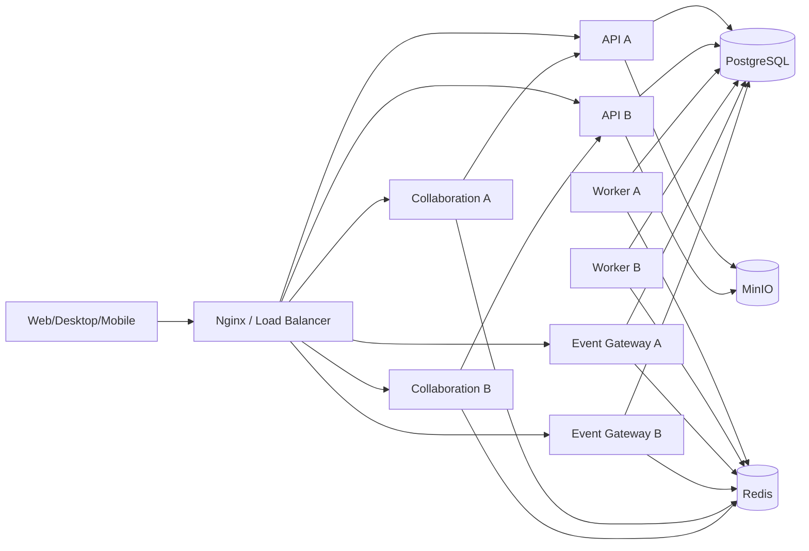

# 模块化单体与独立运行组件目标架构

## 1. 文档定位

本文是已激活的 `PLATFORM-SCALE` 正式目标架构，约束已完成的 S03、当前执行的 S04 及后续平台化 Stage。它描述目标和演进边界，不代表目标能力已经实现；当前事实仍以 `docs/01-architecture/current-architecture.md` 为准。

源基线已在干净主干 `134c370` 复验：当前为 15 个后端模块、233 个 Java 文件、204 条跨模块 import、47 条 foreign infrastructure import、58 个依赖方向，11 个核心模块仍处于同一强连通分量。S04 相对 `ee8fb68` 新增 18 个 Java 文件、10 条跨模块 import 和 6 条 foreign infrastructure import，但没有新增依赖方向；前端仍为 16 个 feature、64 条跨 feature import 和 `knowledgeBases <-> search` 循环。

## 2. 目标

把 Colla Platform 演进为：

1. 一个具有自动边界门禁的业务模块化单体。
2. 可水平增加实例的无状态 HTTP API。
3. 可独立增加实例的异步 Worker。
4. 可独立增加实例的通用实时事件网关。
5. 继续独立运行和扩容的 Hocuspocus/Yjs 知识协同组件。
6. 共享 PostgreSQL、Redis 和 MinIO 的单企业部署基线。

“独立运行组件”不等于业务微服务。API、Worker 和通用实时网关第一阶段继续使用同一 Server 源码和构建产物，通过运行角色选择 Bean、端口和职责。

## 3. 非目标

本专项不以以下事项作为完成条件：

- 不拆分前后端仓库。
- 不把 15 个业务模块拆成 15 个服务。
- 不为每个模块建立独立数据库。
- 不引入 Kafka 作为前置条件。
- 不要求 Kubernetes 或自动扩缩容。
- 不删除共享数据库中的 workspace/user 外键。
- 不重写 Hocuspocus/Yjs 协同协议。
- 不顺带重做 PROJECT-PLATFORM 的字段、布局、发布或工作项产品能力。
- 不承诺 PostgreSQL、Redis、MinIO 的集群高可用；先交付应用层横向能力和可恢复基线。

## 4. 目标拓扑



PostgreSQL 是业务事实、outbox 和协同 durable update 的事实源。Redis 只承担瞬时广播、presence、协调和有限的短生命周期状态；Redis 消息不得成为唯一业务事实。

## 5. 运行角色

| 角色 | 主要职责 | 明确禁止 | 独立扩容依据 |
| --- | --- | --- | --- |
| `api` | HTTP API、事务命令、查询、outbox append、文件访问 | 不执行事件轮询；不保存通用 WS session；不运行旧知识协同定时任务 | HTTP RPS、延迟、连接池和 CPU |
| `worker` | claim outbox、执行业务 handler、增量索引、通知落库、重试/replay | 不接受用户业务 HTTP；不持有 WebSocket session | backlog、oldest age、handler latency |
| `event-gateway` | `/ws/events`、本地 session、Redis fanout、重连校准 | 不执行业务写事务；不直接操作业务模块 Repository | WebSocket connection、fanout rate、内存 |
| `collaboration` | Hocuspocus/Yjs 房间、awareness、Redis 协同、durable update gateway | 不承担 IM/通知通用事件；不复制知识权限事实 | 活跃房间、编辑连接、更新速率 |
| `migration/maintenance` | 显式迁移、修复和一次性维护命令 | 不在每个 API 实例启动时隐式执行大规模业务迁移 | 运维计划和审计 |

运行角色必须通过显式配置激活，默认生产配置不能同时悄悄启用 API、Worker 和旧协同定时任务。

### 5.1 S02 运行角色准入合同

S02 使用同一 Server artifact，通过单值配置 `colla.runtime.role`（环境变量 `COLLA_RUNTIME_ROLE`）选择运行角色。允许值只有 `api`、`worker`、`event-gateway`、`maintenance`；生产环境缺失、未知或尝试组合多个角色时启动失败。`local`/`test` 可以保留显式 `combined` 兼容模式用于开发与完整测试，但不得进入生产 Compose、容量证据或发布模板。

| 角色 | 必须启用 | 必须禁用 | readiness 依赖 | 回退点 |
| --- | --- | --- | --- | --- |
| `api` | MVC、安全过滤器、事务命令、查询、outbox append、文件 API | `DomainEventWorker`、通用 WS session、旧 Spring 知识 room/presence/autosave、批量修复任务 | PostgreSQL；文件接口单独反映 MinIO 状态 | 单实例 `api`，不恢复 Worker/WS Bean |
| `worker` | outbox claim/dispatch、重试、投影和通知 handler | 用户业务 Controller、通用 WS、知识协同、启动期业务迁移 | PostgreSQL；需要广播的 handler 另检查 Redis | 停止 Worker 后保留 outbox 积压，不回退到 API 内轮询 |
| `event-gateway` | `/ws/events`、认证查询、节点内 session、Redis fanout、REST 校准入口 | 业务写 Controller、outbox 消费、业务 Repository 写、知识 Yjs 协议 | Redis、认证/校准所需 PostgreSQL 或 API | 回退为单 gateway，不把 session 放回 API |
| `maintenance` | Flyway、显式初始化、修复/回放命令、审计输出 | 用户流量、业务定时任务、WS、长期运行 Worker | 当前维护命令依赖；不加入流量 upstream | 命令失败即停止，修复后重跑 |

Bean 边界必须用条件配置或 role-specific configuration 表达，不能在方法体内通过 `if (role)` 隐藏已实例化的错误 Bean。S02 的自动测试必须枚举四个生产角色及 `combined` 测试模式，断言 Bean 存在/缺失、端口暴露、定时任务数量和启动失败组合。

### 5.2 Health、readiness 与停机合同

- 所有长期运行角色提供 `/actuator/health/liveness`、`/actuator/health/readiness` 和带 `runtimeRole`、版本、commit 的 `/actuator/info`。
- liveness 只判断进程能否继续运行，不因短暂 PostgreSQL/Redis/MinIO 故障触发重启风暴。
- readiness 只在该角色承诺的依赖可服务时为 `UP`；`maintenance` 不进入 Nginx upstream。
- API 收到终止信号后先变为 not-ready，再停止接收新请求，并给予最多 30 秒完成在途事务；超时才强制退出。
- Worker 收到终止信号后停止 claim 新事件，等待当前 handler 完成或安全释放 lease；Event Gateway 先拒绝新连接，再关闭现有连接并要求客户端重连校准。
- role 标签必须进入请求、事件、健康和指标日志，避免双实例故障时无法定位责任进程。

## 6. 模块边界

### 6.1 允许依赖

业务模块只能依赖：

1. 自身 api/application/domain/infrastructure。
2. `shared` 中不含业务语义的技术原语。
3. 其他模块显式发布的 `contract`。

推荐增加：

```text
com.colla.platform.modules.<module>.contract
```

该包只包含：

- 跨模块 facade 接口。
- 输入输出 record。
- 稳定标识和值对象。
- 领域事件合同。
- SPI。

合同实现留在 provider 的 application/infrastructure 内。HTTP Controller DTO 不自动成为内部模块合同。

### 6.2 禁止依赖

- 任何模块 import 其他模块的 `infrastructure`。
- 任何模块 import 其他模块的 Controller 或 HTTP DTO。
- `shared` import 任一业务模块。
- 组合页面服务直接拼装多个模块 Repository。
- 业务命令直接更新其他 owner 的表。
- 新代码通过添加全局 helper 隐藏跨模块依赖。

### 6.3 组合模块

`workspace` 和 `admin` 可以编排多个模块的 query facade，但不能直接依赖其 Repository。组合模块不拥有来源业务事实，也不能开启跨 owner 写事务。

### 6.4 平台对象

平台对象采用反向 SPI：

- `platform.contract` 定义 resolver SPI 和权限安全摘要。
- 业务模块实现 resolver。
- registry 通过 Spring 发现实现。
- platform application 不 import 具体业务模块。

### 6.5 权限解析

权限模块通过合同解析主体和资源：

- `SubjectDirectory`：用户、部门、用户组的最小状态。
- `ResourceDescriptorProvider`：资源存在性、workspace、owner 和可披露状态。
- `PermissionDecision`：允许、拒绝、隐藏和解释。

权限模块不能读取 knowledge/project/Base 私表来猜测资源语义；资源模块也不能直接写 `resource_permissions`。

## 7. 自动门禁

### 7.1 后端

采用 ArchUnit 作为第一阶段门禁：

- 禁止 foreign infrastructure import。
- 禁止 shared -> modules。
- 限制 module -> foreign contract。
- 检查 contract 不依赖 provider infrastructure。
- 输出模块有向图和强连通分量。

现有违规进入带 owner、原因、退出 Stage 和截止条件的 baseline allowlist。门禁允许历史基线存在，但任何新增违规立即失败；触及旧违规的改动必须减少或保持，不得扩大。

Spring Modulith 可以在循环依赖显著减少后再评估，不作为 S01 前置。

### 7.2 前端

使用 TypeScript AST 和 tsconfig 路径解析：

- feature 只从其他 feature 的 public entry import。
- 禁止跨 feature 深路径。
- 页面路由继续懒加载。
- app shell 可以组合 feature public entry。
- shared 不能 import feature。

### 7.3 数据

维护机器可读 table owner 清单，并组合：

- SQL token 静态扫描。
- Repository ownership 检查。
- Testcontainers 数据隔离和权限测试。
- 人工复核动态 SQL。

静态正则只能作为候选发现器，不能作为唯一完成证据。

## 8. 数据边界

### 8.1 共享数据库

第一阶段继续：

- 一个 PostgreSQL 数据库。
- 一个 Flyway 迁移链。
- 一个业务 schema。
- workspace/user 复合边界和外键。

模块化边界不等于物理 schema 拆分。

### 8.2 写入规则

- 每张业务表只有一个 owner。
- 只有 owner Repository 可以修改该表。
- 其他模块通过 command facade 或异步事件请求变化。
- 组合查询不得借机写入来源表。
- 跨模块批量业务操作使用显式流程协调器，记录每一步、补偿和最终状态。

离职交接应从一个 identity 本地事务改为可恢复流程：

1. identity 冻结待离职成员并创建交接流程。
2. knowledge、IM、project 分别执行 owner 交接。
3. 每步幂等并记录状态。
4. 全部完成后禁用成员。
5. 失败可以重试或人工介入，不留下无法解释的半完成事务。

### 8.3 读取规则

- 业务详情由 owner query facade 提供。
- 批量展示身份通过 directory batch query。
- 搜索维护自己的 `search_index_entries` 投影。
- 企业治理使用专用治理投影或多个 query facade。
- 暂时保留的 search/admin 私表只读例外必须可枚举、可观测且有退出 Stage。

## 9. 异步模型

### 9.1 交付语义

采用 PostgreSQL transactional outbox 和 at-least-once delivery：

- 不声称 exactly once。
- handler 必须按 event ID 或业务 dedupe key 幂等。
- 业务事务只 append event，不同步调用异步消费者。

### 9.2 事件合同

目标 envelope 至少包括：

- `eventId`
- `eventType`
- `eventVersion`
- `workspaceId`
- `aggregateType`
- `aggregateId`
- `actorId`
- `occurredAt`
- `correlationId`
- `causationId`
- `idempotencyKey`
- `payload`

事件 payload 不泄露密码、token、文件密钥或隐藏资源标题。

### 9.3 Claim 和恢复

事件状态至少支持：

- `pending`
- `processing`
- `processed`
- `dead_letter`

processing 增加：

- `claimed_at`
- `lease_until`
- `worker_id`
- `attempt_count`

超时 lease 可以安全回收。达到最大重试后进入 dead letter，由受权限保护的运维命令检查和 replay。

### 9.4 Handler

Worker 通过 handler registry 按 event type/version 分派：

- Notification handler。
- Search projection handler。
- Realtime signal publisher。
- 后续 automation/webhook handler。

单个 handler 失败不能阻止无关事件永久推进；需要明确是否按 aggregate 有序。

### 9.5 Search

搜索从 workspace 全量 refresh 迁移为：

- owner 事件携带可安全索引的变化标识。
- Search handler 按对象增量 upsert/delete。
- 重建索引是显式维护操作。
- 权限过滤仍以当前权限事实为准，不把过时标题或 ACL 快照当授权依据。

## 10. 通用实时事件

### 10.1 Gateway

`event-gateway` 保存自身节点上的 WebSocket session，并订阅 Redis pub/sub。每个 gateway 节点都接收面向用户或 workspace 的瞬时信号，再只向本地 session 推送。

Redis pub/sub 可以用于通用事件，因为：

- 通知、消息、项目和权限的数据库记录是事实源。
- 客户端连接或重连后必须通过 REST 获取未读数、最新消息和对象状态。
- WebSocket 是低延迟失效通知，不是唯一交付记录。

### 10.2 客户端恢复

每类事件必须定义：

- 推送 payload 的最小字段。
- 可用于去重或比较的 sequence/version。
- 重连后调用的 REST 校准接口。
- 无权限或资源删除后的安全降级。

Gateway 节点退出时，客户端重连到其他节点并执行校准，不依赖粘性会话恢复事实。

### 10.3 知识协同

Hocuspocus/Yjs 保持独立链路：

- Redis 负责跨节点广播和 awareness。
- PostgreSQL snapshot/update 是 durable source。
- Spring 只提供权限 ticket、load/store/invalidate gateway。
- 旧 Spring room/presence/autosave 链路经过观测后退出。

## 11. 观测和运维

每个运行角色必须提供独立 health/readiness 和标签：

### API

- RPS、P50/P95/P99。
- 4xx/5xx。
- DB pool 使用率。
- 外部依赖延迟。
- request/correlation ID。

### Worker

- pending 数量。
- oldest pending age。
- processing 数量和过期 lease。
- handler success/failure/retry/dead-letter。
- 每类事件处理延迟。

### Event Gateway

- 当前连接数。
- 每秒 fanout。
- Redis 状态。
- 发送失败和慢客户端。
- 重连和校准次数。

### Collaboration

继续保留现有 node、room、connection、watermark、pending update、persistence latency、recovery 和 Redis 指标。

## 12. 容量验收草案

以下是规划用 `C1` 验证负载，不是当前容量承诺。激活最终容量 Stage 前必须冻结硬件、容器限制、数据库参数、数据分布和负载脚本。

### 12.1 候选 C1 负载

| 指标 | 候选值 |
| --- | ---: |
| 注册成员 | 2,000 |
| 同时在线成员 | 500 |
| 混合 HTTP 持续负载 | 150 RPS |
| `/ws/events` 长连接 | 1,000 |
| 同时知识协同客户端 | 100 |
| 活跃协同房间 | 至少 25 |
| 异步持续写入 | 30 events/s |
| 异步五分钟突发 | 150 events/s |
| 工作项数据 | 1,000,000 |
| 知识内容节点 | 100,000 |
| 知识内容块 | 1,000,000 |

### 12.2 候选服务指标

| 指标 | 候选门槛 |
| --- | --- |
| HTTP read P95 | 不高于 300 ms |
| HTTP write P95 | 不高于 500 ms |
| 非预期 5xx | 低于 0.5% |
| 通用实时 fanout P95 | 不高于 1 s |
| WS 重连并完成 REST 校准 | 不高于 10 s |
| 协同更新跨节点收敛 P95 | 不高于 1 s |
| outbox oldest age P95 | 不高于 5 s |
| 正常负载下 dead letter | 0 |
| 单 API 节点退出 | 新请求继续成功，只允许在途请求失败 |
| 单 Worker 退出 | lease 到期后接管，不丢事件、不重复副作用 |
| 单 Gateway 退出 | 客户端重连并校准，无永久未读或消息缺口 |

### 12.3 验证工具

- HTTP 和普通 WebSocket：固定版本的容器化 k6 或等价工具。
- Hocuspocus/Yjs：Node 协议客户端负载器。
- 数据种子：可重复、workspace 隔离且可清理。
- 故障注入：显式停止单节点、短时断开 Redis、杀死 processing Worker。
- 长稳：至少一轮 60 分钟目标负载和一轮 8 小时低强度 soak。

## 13. 演进顺序

1. 使用已经完成的 S04 后干净主干基线建立可重复扫描。
2. 建立 contract、table owner 和自动门禁，先阻止新增违规。
3. 修复 PROJECT-PLATFORM 当前触及的 project -> identity/file/platform 边界。
4. 增加运行角色，先把 Worker 和旧定时任务从 API 角色移出。
5. 交付双 API 基线。
6. 完成 Worker lease、handler 和指标。
7. 交付通用 event gateway 和 Redis fanout。
8. 退出 Spring 旧知识协同。
9. 完成容量、故障和恢复验收。

不要求先清零所有历史依赖再恢复产品开发。S01/S02 需要建立足够门禁和运行隔离，之后根据风险决定恢复 `PROJECT-PLATFORM-S05`，剩余历史依赖按触及即收敛原则推进。

## 14. S02 双 API 与故障验收输入

### 14.1 部署拓扑

- `api-a`、`api-b` 使用相同不可变镜像和 `COLLA_RUNTIME_ROLE=api`，独立进程、端口、连接池和实例 ID，共享 PostgreSQL、Redis、MinIO。
- Nginx 为 HTTP API 建立包含两个节点的 upstream，使用主动 readiness 与被动失败摘除；Web、event gateway 和 collaboration upstream 保持独立。
- API 不要求粘性会话。JWT 验证材料、设备会话、撤销状态、幂等回执和业务事实来自共享持久层，不能依赖某个 JVM 内存。
- 单节点部署仍是允许的回退形态，但配置和 schema 与双节点完全相同，不引入双写或降级专用代码路径。

### 14.2 初始化与幂等

| 事项 | S02 冻结要求 |
| --- | --- |
| Flyway | 由 `maintenance` 显式执行；API 生产启动只做 schema 兼容检查，不允许两个 API 同时隐式承担大规模迁移 |
| 管理员/系统数据初始化 | 使用数据库唯一约束和幂等 upsert；重复执行结果一致，并记录执行者、版本和结果 |
| MinIO bucket/policy | `maintenance` 幂等创建与校验；失败不阻止非文件 API 暴露 readiness，但文件能力明确不可用 |
| 命令幂等 | request id/command receipt 由 PostgreSQL 唯一约束保证；同请求落到不同 API 返回相同业务结果 |
| 缓存与本地状态 | 本地缓存只能是可丢失加速层；节点退出后由共享事实重建，不能承载权限、会话或未读唯一事实 |

### 14.3 故障与回滚矩阵

| 故障 | 预期行为 | 阻断条件 |
| --- | --- | --- |
| 停止 `api-a` | readiness 先摘除；新请求由 `api-b` 完成；只允许已建立且未完成的在途连接失败 | 新登录或后续请求依赖原节点、幂等结果分叉 |
| PostgreSQL 不可用 | 两个 API readiness 降级；写请求失败且不产生部分副作用 | 任一节点继续宣称可写、恢复后出现孤立 outbox/audit |
| Redis 短暂不可用 | durable HTTP 事实仍以 PostgreSQL 为准；依赖瞬时广播的能力显式降级并在恢复后校准 | Redis 消息丢失造成永久业务事实缺口 |
| MinIO 不可用 | 上传/下载明确失败；不依赖文件的查询和命令继续服务 | 整个 API 无差别退出或产生已完成但无对象的文件记录 |
| 初始化重复执行 | 两节点或重启不产生重复管理员、策略、bucket 或迁移副作用 | 非幂等启动、节点顺序改变结果 |
| 回退到单 API | 从 upstream 摘除一个节点，不回滚 schema；功能与权限合同保持一致 | 需要数据回滚或专用单节点代码才能恢复 |

S02 验收使用真实双 API、共享依赖和具名隔离数据，覆盖登录/续用、跨节点重复命令、上传初始化、优雅停机、单节点退出和依赖故障；最终实现结果见第 16 节。

## 15. S01 收口与 S02 准入结果

2026-07-24 S01 收口时已满足：

1. 15 个模块、后端/前端图、85 张有效表和 93 条只读例外均可由跨平台命令重复生成。
2. project foreign private/infrastructure import 与 shared 业务反向依赖均为 0；foreign write 为 0。
3. 后端、前端、table owner、SQL 例外和文档合同已进入自动门禁。
4. M1-M4 的 52 项实现证据唯一且无 Pending；M5 使用完整 route-final 收口。
5. S02 的运行角色、Bean、health/readiness、双 API、初始化、幂等、故障与回退输入已冻结。
6. `PROJECT-PLATFORM` 继续暂停在 S05 之前；S02 尚未激活，不冒充已实现。
7. Program、目标架构和完成路线统一使用 revision 2。

## 16. S02 收口结果与后续边界

2026-07-24 S02 收口时已满足：

1. 同一 Server artifact 以 `api`、`worker`、`event-gateway`、`maintenance` 四个生产角色运行，`combined` 仅允许 local/test。
2. API 不创建 DomainEventWorker、通用 WebSocket session、旧知识协同 scheduler 或维护 runner；Worker/Gateway/Maintenance 按冻结职责运行。
3. `api-a`、`api-b` 共享 PostgreSQL、Redis、MinIO，不使用粘性会话；真实入口完成分流、优雅/强制退出、恢复和单 API 回退。
4. 登录/撤销、幂等命令、上传、管理员/bucket 初始化、fresh 66 migrations 与 PostgreSQL/Redis/MinIO 故障矩阵已通过隔离自动复验。
5. S01 的 project/shared P0 边界和 foreign write 保持 0；93 条批准的跨 owner read 没有扩散。由于它们不属于运行隔离交付，退出阶段重新批准为 PLATFORM-SCALE-S05，并继续按触及即收敛治理。
6. Worker 仍为单实例，Event Gateway 尚无多节点 fanout，PostgreSQL/Redis/MinIO 仍是单点故障域；当前结果不构成容量或基础设施高可用承诺。
7. Go/No-Go 结论为 S02 归档后重新评估恢复 `PROJECT-PLATFORM-S05`；S03-S05 作为可恢复承诺保留，不在本路线提前激活。

运行与回退步骤见 `docs/05-runbooks/platform-scale-s02-runtime.md`。

## 17. S03 激活合同

S03 在 S02 完成路线归档后按用户决策激活。S02 的历史 Go/No-Go 建议保留，revision 5 不改写其证据，只冻结以下新增执行合同：

1. `domain_events` 继续是 PostgreSQL 中的事务 outbox 事实，但事件 envelope 必须增加稳定 version、aggregate sequence、correlation、causation 和敏感字段边界。
2. 事件与消费者结果分离。每个匹配的 Handler 拥有独立 delivery、attempt、lease、错误和幂等 receipt；事件整体完成不能掩盖单 Handler 未完成。
3. claim 使用 `FOR UPDATE SKIP LOCKED` 或等价 PostgreSQL 原子机制，并携带 worker identity、lease deadline 和递增 fencing token；过期 owner 不能提交新 owner 的结果。
4. 重试必须区分 transient/permanent/unknown，采用有界退避和最大次数。dead letter、inspect、replay 和 abandon 通过受保护的 Maintenance 入口执行并写审计，禁止直接改表恢复。
5. 对需要顺序的 aggregate 使用显式 sequence/partition 合同；不同 aggregate 和无顺序 Handler 可以并行，不能依赖 `created_at` 或 UUID 排序。
6. Worker 调度使用有界 executor 和队列；队列饱和时停止 claim。batch、concurrency、lease、heartbeat、连接池和 shutdown 均由可校验配置限制。
7. 生产模板至少验证两个 Worker 实例使用相同 artifact、独立 instance id 和共享 PostgreSQL，扩缩 Worker 不改变 API 实例数。
8. Notification、Search 和 realtime signal 通过版本化 Handler registry 分派；`DomainEventWorker` 不再硬编码业务类型或直接依赖业务私有 Repository。
9. Search 使用对象级增量 upsert/delete，显式 Maintenance 才能全量重建。索引投影不是授权事实，读取仍按当前权限过滤。
10. realtime signal 仅提示 durable fact 变化；S03 建立 transport contract 和结果观测，不提前实现 S04 的 Redis 多 Gateway fanout。
11. Worker 指标至少覆盖 pending、oldest age、processing、expired lease、Handler latency、retry、dead letter、吞吐和 draining，标签禁止 workspace/payload 高基数。
12. S03 最终必须以真实双 Worker 验证排他 claim、崩溃接管、旧 fencing 拒绝、毒事件隔离、积压恢复、扩缩和单 Worker 回退；结果不是 S05 容量承诺。

## 18. S04 激活合同

S04 在 S03 完成路线归档后按 Go 决策激活。revision 7 保留 S03 的历史故障与性能证据，只冻结以下新增执行合同：

1. realtime signal 使用稳定 type/version、workspace、recipient/audience、object、sequence、correlation 和最小 payload；Redis 与 WebSocket 不承载唯一业务事实。
2. Worker 通过 transport-neutral contract 发布 signal；Event Gateway 订阅 Redis 并只向本节点 session fanout。API、Worker 和业务模块不得直接操作本地 session registry。
3. 每个 Gateway 节点使用独立 instance id 和本地连接集合；至少以两个节点证明同一目标连接的正确投递、跨租户隔离、节点退出和单节点回退。
4. Redis pub/sub channel、序列化、未知版本、重订阅和失败策略必须唯一。Redis 中断不回滚业务事实，恢复不伪造历史补发，客户端通过 REST 校准 durable state。
5. 慢客户端和发送异常使用有界队列、串行连接发送和隔离关闭，不得阻塞 Redis subscriber 或其他用户。
6. IM、通知、项目和权限 signal 都定义最小 payload、sequence、recipient 和 REST 校准入口；权限收紧或资源删除只能发送安全失效提示。
7. 客户端实现统一连接状态机、指数退避、sequence watermark、去重、gap 检测及按域校准；账号/workspace 切换必须清理旧订阅和水位。
8. Gateway 连接成功、断线重连、sequence gap、浏览器恢复和权限变化都必须以 REST 事实收敛，不依赖 Redis 消息历史或粘性会话。
9. Hocuspocus/Yjs 是知识内容唯一实时协议；Redis 负责跨 collaboration 节点 update/awareness，PostgreSQL snapshot/update 保持 durable source。
10. Spring 只保留知识权限 ticket、load/store/invalidate gateway；旧 `CollaborationMessageHandler`、room、presence、autosave、cleanup 和 Event Gateway 知识编辑命令经过观测与关闭演练后退出。
11. Event Gateway 指标至少覆盖连接、订阅、fanout、发送失败、慢客户端、重连、校准和 Redis 状态；collaboration 继续覆盖 room、connection、watermark、update、persistence、recovery 和 Redis 状态。
12. S04 最终必须以真实双 Gateway 和双 collaboration 节点验证 fanout、节点退出、Redis 中断、重连校准、知识编辑收敛和 durable recovery；结果只证明功能与恢复门槛，不构成 S05 容量或基础设施 HA 承诺。

## 19. 修订记录

| Revision | 日期 | 变更 | 依据 |
| --- | --- | --- | --- |
| 1 | 2026-07-24 | 在 S04 合入后的干净主干复验模块、数据、前端、实时和异步边界；正式冻结模块合同、运行角色、共享数据库、outbox、实时网关和容量验收方向 | `platform-scale-readiness-baseline-2026-07-24.md` 与 S04 合入后审计 |
| 2 | 2026-07-24 | 收口 S01 自动边界与 project P0 治理，冻结 S02 单角色 Bean、health/readiness、双 API、初始化、幂等、故障和回退输入 | M1-M5 执行报告、architecture inventory/boundary gate 与 S01 route-final |
| 3 | 2026-07-24 | 基于已冻结准入合同激活 S02，明确同一 artifact 的四生产角色、双 API 验证边界和不提前实现 S03-S05 | S01 完成路线归档与 S02 当前执行路线 |
| 4 | 2026-07-24 | 收口 S02 四生产角色、双 API、跨节点状态、维护初始化、故障恢复与单 API 回退，冻结剩余 S03-S05 边界 | S02 M1-M5 执行报告、运行手册与 route-final |
| 5 | 2026-07-24 | 归档 S02 并激活 S03，冻结逐 Handler delivery、lease/fencing、dead letter/replay、多 Worker、背压和 Handler 迁移合同 | 用户在 S02 Go/No-Go 后选择继续平台扩展；当前单 Worker 和硬编码消费仍是明确运行风险 |
| 6 | 2026-07-24 | 收口 S03 可靠消费、多 Worker 分流/接管、Handler 隔离、迁移并发和故障恢复合同 | S03 的 54 项验收与真实 PostgreSQL、双 Worker、路由级验证完成；下一运行风险转移到通用实时 Gateway 和旧协同退出 | S03 Completed 等待归档；S04 建议 Go，PROJECT-PLATFORM 本轮保持 Paused |
| 7 | 2026-07-24 | 归档 S03 并激活 S04，冻结 realtime envelope、Redis fanout、双 Gateway、客户端重连校准和旧 Spring 知识协同退出合同 | S03 已提供可靠 signal 生产与多 Worker 基线；当前单 Gateway、本地 session 和双知识协议仍阻断应用层水平扩展 |
