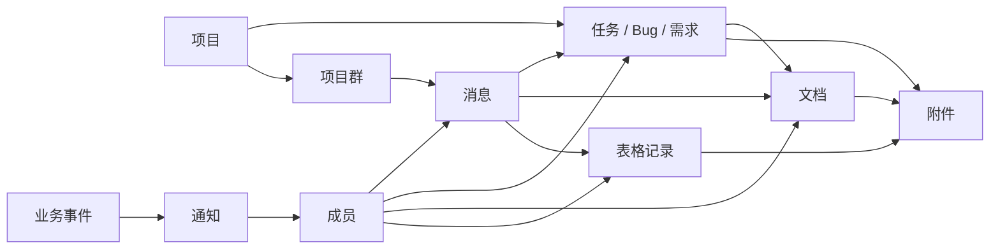

# 第一阶段 MVP 需求清单与页面原型说明

## 1. 文档目的

本文档用于把《轻量协同工作平台 PRD + 技术架构草案》中的第一阶段范围拆解成可执行需求、页面原型说明和验收口径。

第一阶段的数据表、接口、WebSocket、领域事件和权限规则见：[第一阶段技术设计：数据表、接口、事件与权限](./phase1-technical-design.md)。

第一阶段目标不是复刻 Lark，而是让内部研发团队可以在一个平台里完成以下闭环：

- 通过 IM 沟通和接收通知。
- 在项目中管理需求、任务和 Bug。
- 用文档沉淀需求、方案和会议记录。
- 用多维表格管理结构化协作数据。
- 通过统一权限和通知把上述模块连接起来。
- 为 Web、桌面端、移动端共享同一套对象、权限、链接、通知和 API 奠定基础。

## 2. MVP 边界

### 2.1 第一阶段必须完成

- 登录和成员管理。
- 全局布局和工作台。
- IM 单聊、群聊、项目群。
- 文本消息、文件消息、@提醒、未读数、内部业务链接卡片。
- 项目、任务、Bug、看板、评论、附件。
- 文档空间、文档编辑、文档版本保存。
- 多维表格空间、字段配置、记录增删改查、筛选排序。
- 通知中心。
- 基础角色和资源权限。

### 2.2 第一阶段明确不做

- 音视频会议。
- 完整移动端工作台 App。
- 实时多人文档协同。
- 复杂公式、透视表和 Excel 兼容。
- 自动化机器人平台。
- 外部客户协作。
- 多租户 SaaS。
- OA 审批流。
- 复杂甘特图和资源排期。
- 消息端到端加密。
- 外部网页链接 metadata 预览。

### 2.3 优先级定义

| 优先级 | 含义 |
| --- | --- |
| P0 | MVP 必须具备，没有则无法形成第一阶段闭环 |
| P1 | 第一阶段建议具备，可根据排期后置到同阶段后半段 |
| P2 | 明确后置，不进入第一阶段交付 |

## 3. 用户故事总览

| 编号 | 用户故事 | 优先级 |
| --- | --- | --- |
| US-001 | 作为团队成员，我可以登录平台并进入工作台 | P0 |
| US-002 | 作为管理员，我可以添加、禁用和管理成员 | P0 |
| US-003 | 作为团队成员，我可以查看自己的未读消息、待办任务和最近文档 | P0 |
| US-004 | 作为团队成员，我可以与成员单聊或在群里沟通 | P0 |
| US-005 | 作为团队成员，我可以在消息中 @其他成员并触发通知 | P0 |
| US-006 | 作为团队成员，我可以上传文件到消息、任务、文档或表格记录 | P0 |
| US-007 | 作为团队成员，我可以在 IM 中分享需求、Bug、文档或表格链接并显示缩略卡片 | P0 |
| US-008 | 作为团队成员，我可以在 Web、桌面端、移动端使用同一个账号访问平台核心对象 | P0 |
| US-009 | 作为项目负责人，我可以创建项目并添加项目成员 | P0 |
| US-010 | 作为项目成员，我可以创建任务、需求或 Bug | P0 |
| US-011 | 作为项目成员，我可以在看板中流转任务或 Bug 状态 | P0 |
| US-012 | 作为项目成员，我可以评论任务或 Bug 并 @相关人员 | P0 |
| US-013 | 作为团队成员，我可以创建和编辑文档 | P0 |
| US-014 | 作为团队成员，我可以把文档关联到任务或 Bug | P1 |
| US-015 | 作为团队成员，我可以创建多维表格并配置字段 | P0 |
| US-016 | 作为团队成员，我可以维护表格记录并筛选、排序 | P0 |
| US-017 | 作为团队成员，我可以收到与自己相关的系统通知 | P0 |
| US-018 | 作为管理员，我可以配置成员在项目、文档、表格中的基础权限 | P0 |
| US-019 | 作为团队成员，我可以搜索消息、任务、文档和表格 | P1 |

## 4. 信息架构

### 4.1 全局导航

左侧主导航：

- 工作台。
- 消息。
- 项目。
- 文档。
- 表格。
- 通知。
- 管理后台。

顶部区域：

- 全局搜索入口。
- 创建入口。
- 通知入口。
- 当前用户菜单。

右侧上下文面板：

- 在任务详情中显示关联文档、附件、动态。
- 在文档中显示目录、评论、关联对象。
- 在表格中显示记录详情。

### 4.2 核心对象关系



## 5. 功能需求清单

### 5.1 账号、成员与权限

#### REQ-AUTH-001 登录

优先级：P0

说明：

- 用户通过账号密码登录。
- 登录成功后进入工作台。
- 登录态过期后跳转登录页。

验收标准：

- 输入正确账号密码可以登录。
- 输入错误账号密码显示明确错误提示。
- 未登录访问业务页面时跳转到登录页。

#### REQ-AUTH-002 成员管理

优先级：P0

说明：

- 管理员可以创建成员。
- 管理员可以编辑成员姓名、头像、部门、角色。
- 管理员可以禁用成员。
- 禁用成员不能登录，但历史数据保留。

验收标准：

- 管理员可以新增成员并设置初始密码。
- 禁用成员再次登录时被拒绝。
- 已禁用成员在历史消息、任务、文档中仍正常显示。

#### REQ-AUTH-003 基础权限

优先级：P0

说明：

- 系统内置管理员、普通成员。
- 项目内置项目负责人、项目成员、只读成员。
- 文档和表格支持可查看、可编辑、可管理。

验收标准：

- 普通成员不能访问管理后台。
- 只读项目成员不能编辑项目事项。
- 无文档权限的用户不能查看文档内容。

### 5.2 工作台

#### REQ-DASH-001 工作台首页

优先级：P0

说明：

工作台是用户登录后的默认页面，聚合个人最重要的信息。

模块：

- 我的未读消息。
- 我的待办任务。
- 我负责的 Bug。
- 最近访问文档。
- 最近访问表格。
- 系统通知摘要。

验收标准：

- 用户登录后默认进入工作台。
- 点击待办项可以进入对应任务或 Bug。
- 点击未读消息可以进入对应会话。
- 点击文档或表格可以进入对应页面。

### 5.3 IM

#### REQ-IM-001 会话列表

优先级：P0

说明：

- 展示单聊、群聊、项目群、系统通知会话。
- 会话按最后消息时间排序。
- 显示未读数、最后一条消息摘要、最后消息时间。

验收标准：

- 收到新消息后会话置顶。
- 未读数正确增加。
- 进入会话后未读数清零。

#### REQ-IM-002 消息收发

优先级：P0

说明：

- 支持文本消息。
- 支持文件消息。
- 支持图片作为文件消息展示。
- 消息发送后需要持久化。
- WebSocket 推送在线消息。

验收标准：

- 在线用户可以实时收到消息。
- 刷新页面后历史消息仍存在。
- 发送失败时客户端显示失败状态。

#### REQ-IM-003 @提醒

优先级：P0

说明：

- 在群聊和项目群中输入 @ 可选择成员。
- 被 @成员收到通知。
- @消息在会话中有明确视觉标识。

验收标准：

- 被 @用户的通知中心出现提醒。
- 被 @用户的会话列表有明显未读提示。

#### REQ-IM-004 从消息创建事项

优先级：P1

说明：

- 用户可以从消息快捷创建任务或 Bug。
- 创建时自动带入消息内容作为描述引用。
- 创建成功后消息旁显示事项链接。

验收标准：

- 从消息创建任务后，可以跳转到任务详情。
- 任务详情中可以看到来源消息引用。

#### REQ-IM-005 系统通知会话

优先级：P0

说明：

- 系统事件可以进入系统通知会话。
- 指派任务、Bug 状态变更、评论 @都可生成系统通知消息。

验收标准：

- 被指派任务后，用户可以在系统通知会话看到消息。
- 点击系统通知可以跳转到对应业务对象。

#### REQ-IM-006 内部业务链接卡片

优先级：P0

说明：

- 用户在消息中粘贴内部业务对象链接时，系统自动解析并生成缩略卡片。
- 第一阶段支持需求、任务、Bug、文档、表格空间、数据表、表格记录。
- 卡片展示对象类型、标题、摘要、状态、负责人、更新时间等关键字段。
- 卡片点击后进入对应业务对象。
- 卡片内容必须按查看者权限动态判断。
- 外部网页链接 metadata 预览不进入第一阶段。

验收标准：

- 发送需求、任务或 Bug 链接后，消息中显示事项卡片。
- 发送文档链接后，消息中显示文档标题、摘要和更新时间。
- 发送表格记录链接后，消息中显示表格名、主字段和关键字段。
- 有权限的用户可以看到卡片缩略内容并跳转。
- 无权限的用户只能看到“无权限查看该内容”。
- 对象被删除后，卡片显示“内容已删除”。
- 解析失败时，原始链接仍作为普通文本展示。

#### REQ-IM-007 多客户端接入与同步

优先级：P0

说明：

- IM 需要支持 Web、桌面端和移动端使用同一账号接入。
- 第一阶段交付 Web 端完整 IM。
- 桌面端和移动端第一阶段不要求完整 UI 交付，但服务端协议、消息模型、鉴权、设备模型、未读同步和通知模型必须可支持。
- 同一用户可以在多个设备上同时在线。
- 消息发送、消息接收、会话未读数、已读状态需要跨设备同步。
- 移动端后续需要支持系统推送，不依赖 WebSocket 长连接常驻。

验收标准：

- 同一用户在两个 Web 会话中登录时，一个会话收到消息后另一个会话也能同步未读变化。
- 用户在一个客户端标记会话已读后，其他客户端的未读数可以同步刷新。
- 服务端可以记录客户端设备类型：`web`、`desktop`、`ios`、`android`。
- WebSocket 事件不包含只适用于 Web 的 UI 状态。
- 移动端离线期间产生的消息可以通过消息历史和未读数补偿。
- 系统通知事件具备后续投递到移动推送通道的必要字段。

### 5.4 平台对象与跨端基础

#### REQ-PLAT-001 统一平台对象

优先级：P0

说明：

- 需求、任务、Bug、文档、表格空间、数据表、表格记录、文件、通知都需要作为平台对象处理。
- 平台对象需要提供统一的类型、ID、标题、摘要、内部链接、权限判断和更新时间。
- IM 卡片、工作台、通知中心、搜索、移动端轻量视图都应基于统一平台对象能力。

验收标准：

- 需求、Bug、文档、表格记录可以生成统一内部链接。
- 同一个对象链接可以在 IM、工作台、通知中心中跳转。
- 无权限用户无法通过链接或卡片绕过权限。
- 对象删除后，引用位置可以显示“内容已删除”。

#### REQ-PLAT-002 跨端能力分级

优先级：P0

说明：

- Web 是第一阶段完整生产力端。
- 桌面端后续复用 Web 能力，强调常驻、通知和快速入口。
- 移动端后续优先支持 IM、通知、项目/Bug 查看和流转、文档查看、表格记录查看、审批。
- 第一阶段不交付完整桌面和移动 UI，但接口、权限、链接、通知和对象摘要不能绑定 Web。

验收标准：

- API 响应不包含 Web 专属路由作为唯一跳转依据，需要同时具备对象类型和对象 ID。
- 通知数据包含 `targetType`、`targetId`，可被不同客户端解析。
- 内部链接可被解析为平台对象。
- Web 页面在移动浏览器下至少可查看 IM、通知和对象卡片。

### 5.5 项目、任务与 Bug

#### REQ-PROJ-001 项目管理

优先级：P0

说明：

- 项目负责人或管理员可以创建项目。
- 项目包含名称、描述、负责人、成员、状态。
- 创建项目时自动创建项目群。

验收标准：

- 项目创建成功后出现在项目列表。
- 项目成员可以进入项目详情。
- 非项目成员默认不能进入项目详情，管理员除外。

#### REQ-PROJ-002 事项统一模型

优先级：P0

说明：

需求、任务、Bug 统一作为事项管理，通过类型区分。

通用字段：

- 标题。
- 描述。
- 类型。
- 状态。
- 优先级。
- 负责人。
- 创建人。
- 所属项目。
- 截止时间。
- 标签。
- 附件。

验收标准：

- 用户可以创建需求、任务、Bug。
- 不同类型可以使用不同默认状态流。
- 事项详情页展示完整字段。

#### REQ-PROJ-003 看板视图

优先级：P0

说明：

- 项目详情默认提供看板视图。
- 看板列按状态展示事项。
- 支持拖拽或操作菜单改变状态。

验收标准：

- 拖动事项到新状态列后状态更新。
- 状态变更产生动态记录。
- 无权限用户不能拖动事项。

#### REQ-PROJ-004 事项列表视图

优先级：P0

说明：

- 支持按类型、状态、负责人、优先级筛选。
- 支持按创建时间、更新时间、截止时间排序。

验收标准：

- 筛选条件组合后结果正确。
- 点击列表项进入事项详情。

#### REQ-PROJ-005 事项评论

优先级：P0

说明：

- 任务和 Bug 支持评论。
- 评论支持 @成员。
- 评论支持附件。

验收标准：

- 评论发布后在详情页显示。
- 被 @成员收到通知。
- 评论删除或编辑可以后置，第一阶段可不做。

#### REQ-PROJ-006 我的任务

优先级：P0

说明：

- 用户可以查看自己负责的需求、任务、Bug。
- 支持按项目、类型、状态筛选。

验收标准：

- 工作台和项目模块都可以进入我的任务。
- 指派给当前用户的事项全部可见。

### 5.6 文档

#### REQ-DOC-001 文档空间

优先级：P0

说明：

- 展示文档列表和目录。
- 支持新建文档、重命名、移动目录。
- 支持按最近更新排序。

验收标准：

- 用户可以在有权限的空间中新建文档。
- 文档新建后可以进入编辑页。

#### REQ-DOC-002 文档编辑

优先级：P0

说明：

- 支持标题、正文编辑。
- 正文支持基础富文本或 Markdown。
- 支持保存。
- 保存时记录版本号。

验收标准：

- 文档保存后刷新页面内容不丢失。
- 多人同时编辑时，后保存用户如果版本落后，需要提示冲突。

#### REQ-DOC-003 文档版本

优先级：P0

说明：

- 每次保存生成版本记录。
- 第一阶段只要求可以查看版本列表和恢复版本。

验收标准：

- 文档保存多次后可以看到版本历史。
- 恢复旧版本后当前内容变为旧版本内容，并生成新的版本记录。

#### REQ-DOC-004 文档关联

优先级：P1

说明：

- 文档可以关联项目、任务、Bug。
- 任务详情页可以看到关联文档。

验收标准：

- 在文档页可以添加关联事项。
- 在事项详情页可以跳转到关联文档。

### 5.7 多维表格

#### REQ-BASE-001 表格空间

优先级：P0

说明：

- 用户可以创建表格空间。
- 表格空间下可以创建多个数据表。
- 数据表支持名称和描述。

验收标准：

- 用户可以创建表格空间并进入。
- 用户可以在空间内创建数据表。

#### REQ-BASE-002 字段配置

优先级：P0

说明：

第一阶段字段类型：

- 文本。
- 长文本。
- 数字。
- 单选。
- 多选。
- 日期。
- 成员。
- 附件。
- 复选框。
- URL。

验收标准：

- 用户可以新增、编辑、删除字段。
- 字段类型决定单元格输入控件。
- 删除字段时需要二次确认。

#### REQ-BASE-003 记录维护

优先级：P0

说明：

- 用户可以新增、编辑、删除记录。
- 支持行内编辑。
- 支持打开记录详情面板。

验收标准：

- 新增记录后立即显示在表格中。
- 修改单元格后保存成功并持久化。
- 没有编辑权限的用户只能查看。

#### REQ-BASE-004 筛选和排序

优先级：P0

说明：

- 支持按字段筛选。
- 支持按字段排序。
- 第一阶段视图配置可先保存在当前表级别。

验收标准：

- 文本字段支持包含筛选。
- 单选、多选字段支持等于/包含筛选。
- 日期字段支持范围筛选。
- 数字字段支持大于、小于、等于筛选。

#### REQ-BASE-005 视图保存

优先级：P1

说明：

- 用户可以保存当前筛选、排序、列宽、隐藏列配置。
- 支持多个表格视图。

验收标准：

- 切换视图后筛选和排序配置正确恢复。

### 5.8 通知中心

#### REQ-NOTI-001 通知列表

优先级：P0

说明：

- 展示与当前用户相关的通知。
- 支持未读、已读状态。
- 支持按类型筛选。

验收标准：

- 被 @、被指派、评论回复时生成通知。
- 点击通知可以跳转对应对象。
- 用户可以将通知标记为已读。

#### REQ-NOTI-002 通知投递到 IM

优先级：P0

说明：

- 关键通知进入系统通知会话。
- 通知中心和系统通知会话共享同一事件来源。

验收标准：

- 任务指派后通知中心和系统通知会话都能看到通知。
- 同一通知不会重复生成多条业务记录。

### 5.9 文件

#### REQ-FILE-001 文件上传

优先级：P0

说明：

- 文件可用于 IM、任务评论、文档、表格附件字段。
- 文件上传后生成统一文件记录。
- 业务对象只保存文件引用。

验收标准：

- 文件上传成功后可以下载。
- 文件关联的业务对象删除后，文件不立即物理删除，先保留引用记录。

## 6. 页面原型说明

以下为低保真页面说明，用于指导后续 UI 原型和前端实现。

### 6.1 登录页

目标：

- 让内部成员通过账号密码进入系统。

页面结构：

```text
+------------------------------------------------+
|                  平台名称                       |
|                                                |
|  账号 [                                  ]      |
|  密码 [                                  ]      |
|                                                |
|  [登录]                                        |
|                                                |
|  错误提示区域                                  |
+------------------------------------------------+
```

关键交互：

- 点击登录后校验账号密码。
- 登录失败展示错误。
- 登录成功进入工作台。

### 6.2 全局框架

目标：

- 给所有模块提供一致的导航和上下文入口。

页面结构：

```text
+--------------------------------------------------------------------------------+
| 顶部栏：搜索 / 创建 / 通知 / 用户                                                |
+-------------+------------------------------------------------------------------+
| 工作台       |                                                                  |
| 消息         |                       主内容区                                   |
| 项目         |                                                                  |
| 文档         |                                                                  |
| 表格         |                                                                  |
| 通知         |                                                                  |
| 管理后台     |                                                                  |
+-------------+------------------------------------------------------------------+
```

关键交互：

- 左侧导航切换一级模块。
- 顶部创建入口根据当前上下文创建消息、项目、文档、表格或任务。
- 顶部通知角标显示未读通知数。

### 6.3 工作台

目标：

- 汇总当前用户今天最需要处理的事情。

页面结构：

```text
+--------------------------------------------------------------------------------+
| 工作台                                                                          |
+-----------------------------------+--------------------------------------------+
| 我的待办                           | 未读消息                                   |
| - TASK-12 修复登录异常              | - 项目群：@你看一下这个 Bug                 |
| - BUG-35 表格筛选错误               | - 张三：接口我改好了                         |
+-----------------------------------+--------------------------------------------+
| 我负责的 Bug                        | 最近文档                                   |
| - BUG-36 上传失败                   | - 需求说明：协同平台第一阶段                 |
| - BUG-37 WebSocket 重连异常         | - 会议纪要：项目例会                         |
+-----------------------------------+--------------------------------------------+
| 最近表格                            | 系统通知                                   |
| - 版本计划                          | - 你被指派了 BUG-35                         |
+--------------------------------------------------------------------------------+
```

关键交互：

- 点击任务、Bug、文档、表格进入对应详情。
- 未读消息点击后进入对应会话。
- 工作台不承担复杂数据分析，只做入口聚合。

### 6.4 消息页

目标：

- 支撑日常沟通，并作为事项和通知入口。

页面结构：

```text
+--------------------------------------------------------------------------------+
| 消息                                                                            |
+----------------------+--------------------------------------+------------------+
| 会话列表              | 消息区                                | 会话信息          |
| - 系统通知 3           | 项目群名称                             | 成员              |
| - 项目 A 群 5          |--------------------------------------| 文件              |
| - 张三                | 消息历史                               | 关联项目          |
| - 测试群              | @李四 请看这个问题                     |                  |
|                      | [文件卡片]                             |                  |
|                      | [BUG-12 登录失败 卡片]                 |                  |
|                      |                                      |                  |
|                      |--------------------------------------|                  |
|                      | 输入框 / 附件 / @ / 发送               |                  |
+----------------------+--------------------------------------+------------------+
```

关键交互：

- 选择会话后加载消息。
- 输入 @ 弹出成员选择。
- 上传文件后以文件卡片发送。
- 点击系统通知跳转到业务对象。
- 粘贴内部业务链接后，消息区显示缩略卡片。
- P1 支持从消息创建任务或 Bug。

### 6.5 项目列表页

目标：

- 查看和进入团队项目。

页面结构：

```text
+--------------------------------------------------------------------------------+
| 项目                                             [新建项目]                      |
+--------------------------------------------------------------------------------+
| 筛选：我参与的 / 我负责的 / 全部                                                   |
+--------------------------------------------------------------------------------+
| 项目名称          负责人       成员数       未完成事项       最近更新              |
| 协同平台          王五         8           23              2026-06-13             |
| 内部工具          李四         5           11              2026-06-12             |
+--------------------------------------------------------------------------------+
```

关键交互：

- 点击项目进入项目详情。
- 管理员和项目负责人可新建项目。

### 6.6 项目详情页

目标：

- 以看板和列表管理项目事项。

页面结构：

```text
+--------------------------------------------------------------------------------+
| 项目名称 / 项目说明                       [新建事项] [进入项目群]                 |
+--------------------------------------------------------------------------------+
| Tab: 看板 | 列表 | 成员 | 设置                                                     |
+--------------------------------------------------------------------------------+
| 筛选：类型 / 负责人 / 优先级 / 标签 / 截止时间                                     |
+--------------------------------------------------------------------------------+
| 待处理            处理中             待评审             已完成                    |
| +--------------+  +--------------+  +--------------+  +--------------+            |
| | BUG-12       |  | TASK-18      |  | REQ-02       |  | TASK-03      |            |
| | 登录失败      |  | 表格字段配置  |  | 消息引用      |  | 初始化项目   |            |
| +--------------+  +--------------+  +--------------+  +--------------+            |
+--------------------------------------------------------------------------------+
```

关键交互：

- 点击卡片进入事项详情抽屉或详情页。
- 拖动卡片变更状态。
- 点击进入项目群打开对应 IM 会话。
- 筛选器改变当前看板展示。

### 6.7 事项详情页

目标：

- 管理任务、需求、Bug 的完整上下文。

页面结构：

```text
+--------------------------------------------------------------------------------+
| BUG-12 登录失败                                      [编辑] [状态流转]             |
+-------------------------------------------+------------------------------------+
| 标题 / 描述                                | 属性                               |
|                                           | 类型：Bug                          |
| 评论                                      | 状态：修复中                       |
| - 张三：已复现 @李四                       | 负责人：李四                       |
| - 李四：已提交修复                         | 优先级：高                         |
|                                           | 截止时间：2026-06-20               |
| 动态                                      | 标签：登录                         |
| - 状态从新建变为已确认                     |                                    |
|                                           | 关联                               |
| 附件                                      | 文档                               |
| - error.log                               | 表格记录                           |
+-------------------------------------------+------------------------------------+
```

关键交互：

- 修改状态产生动态。
- 评论支持 @和附件。
- 关联文档后可直接跳转。
- 权限不足时编辑入口隐藏或禁用。

### 6.8 文档空间页

目标：

- 管理团队知识文档。

页面结构：

```text
+--------------------------------------------------------------------------------+
| 文档                                           [新建文档]                         |
+----------------------+---------------------------------------------------------+
| 目录树                | 文档列表                                                 |
| - 需求                | 名称              最近更新        更新人       权限       |
| - 技术方案            | 协同平台 PRD       2026-06-13      王五        可编辑     |
| - 会议纪要            | IM 模块设计        2026-06-12      李四        可查看     |
+----------------------+---------------------------------------------------------+
```

关键交互：

- 点击目录过滤文档。
- 点击文档进入编辑页。
- 新建文档默认放在当前目录。

### 6.9 文档编辑页

目标：

- 让团队成员创建、编辑和沉淀文档。

页面结构：

```text
+--------------------------------------------------------------------------------+
| 文档标题                                         [保存] [历史版本] [权限]          |
+----------------------+--------------------------------------+------------------+
| 文档目录              | 编辑区                                | 右侧面板          |
| - 1 背景              | # 标题                                | 关联事项          |
| - 2 目标              | 正文内容                               | 评论              |
| - 3 方案              |                                      | 附件              |
+----------------------+--------------------------------------+------------------+
```

关键交互：

- 点击保存生成新版本。
- 版本落后时提示冲突。
- 点击历史版本查看版本列表。
- P1 支持关联任务、Bug。

### 6.10 表格空间页

目标：

- 管理多维表格空间和数据表。

页面结构：

```text
+--------------------------------------------------------------------------------+
| 表格                                           [新建表格空间]                     |
+--------------------------------------------------------------------------------+
| 名称              表数量       最近更新        所有人                            |
| 版本计划          3            2026-06-13      王五                              |
| 测试用例库        5            2026-06-12      李四                              |
+--------------------------------------------------------------------------------+
```

关键交互：

- 点击表格空间进入表格编辑页。
- 有权限用户可新建表格空间。

### 6.11 表格编辑页

目标：

- 支持类似 Airtable/飞书多维表格的基础结构化数据管理。

页面结构：

```text
+--------------------------------------------------------------------------------+
| 表格空间名称                                  [新增记录] [字段配置] [筛选] [排序] |
+----------------------+---------------------------------------------------------+
| 数据表列表             | 表格视图                                                 |
| - 需求池               | +----+----------+--------+----------+------------+        |
| - 版本计划             | | ID | 标题     | 状态   | 负责人   | 截止时间    |        |
| - 测试用例             | +----+----------+--------+----------+------------+        |
|                       | | 1  | 登录优化 | 进行中 | 张三     | 2026-06-20  |        |
|                       | +----+----------+--------+----------+------------+        |
+----------------------+---------------------------------------------------------+
| 右侧记录详情面板：字段、附件、关联对象                                              |
+--------------------------------------------------------------------------------+
```

关键交互：

- 点击单元格行内编辑。
- 点击记录打开右侧详情面板。
- 字段配置中新增、编辑、删除字段。
- 筛选和排序即时影响当前表格。

### 6.12 通知中心

目标：

- 汇总用户需要处理或知晓的业务事件。

页面结构：

```text
+--------------------------------------------------------------------------------+
| 通知中心                                      [全部已读]                          |
+--------------------------------------------------------------------------------+
| 筛选：全部 / @我 / 指派 / 评论 / 系统                                             |
+--------------------------------------------------------------------------------+
| 未读  你被指派了 BUG-12 登录失败                         2026-06-13 10:20         |
| 未读  张三在 TASK-18 中 @了你                             2026-06-13 09:50         |
| 已读  文档「IM 模块设计」已更新                            2026-06-12 18:10         |
+--------------------------------------------------------------------------------+
```

关键交互：

- 点击通知跳转到业务对象。
- 点击全部已读后清空未读角标。

### 6.13 管理后台

目标：

- 支撑内部团队最基础的成员和权限维护。

页面结构：

```text
+--------------------------------------------------------------------------------+
| 管理后台                                                                         |
+----------------------+---------------------------------------------------------+
| 成员管理              | 成员列表                                                 |
| 角色权限              | 姓名       账号       角色       状态       操作          |
| 系统设置              | 张三       zhangsan   成员       正常       编辑/禁用     |
|                      | 李四       lisi       管理员     正常       编辑/禁用     |
+----------------------+---------------------------------------------------------+
```

关键交互：

- 管理员可创建成员。
- 管理员可编辑角色。
- 管理员可禁用成员。

## 7. 第一阶段交付拆分

### 7.1 Sprint 0：设计确认

交付：

- MVP 需求清单确认。
- 页面低保真原型确认。
- 技术栈确认。
- 数据模型初稿确认。

### 7.2 Sprint 1：基础框架

交付：

- 前后端工程骨架。
- 登录。
- 成员管理。
- 全局布局。
- 基础权限。

### 7.3 Sprint 2：IM 基础

交付：

- 会话列表。
- 单聊、群聊。
- WebSocket 消息收发。
- 文件消息。
- 未读数。
- 内部业务链接卡片。
- 多客户端接入基础：设备登记、跨设备未读同步、WebSocket 设备绑定。

### 7.4 Sprint 3：项目和 Bug

交付：

- 项目列表。
- 项目详情。
- 任务、需求、Bug。
- 看板。
- 评论和附件。
- 项目群联动。

### 7.5 Sprint 4：文档

交付：

- 文档空间。
- 文档编辑。
- 文档版本。
- 文档权限。
- 文档和事项关联。

### 7.6 Sprint 5：多维表格

交付：

- 表格空间。
- 数据表。
- 字段配置。
- 记录维护。
- 筛选排序。

### 7.7 Sprint 6：通知与收敛

交付：

- 通知中心。
- 系统通知会话。
- 工作台聚合。
- 权限补齐。
- MVP 联调和验收。

## 8. 第一阶段验收清单

### 8.1 业务闭环验收

- 管理员创建成员。
- 成员登录平台。
- 成员创建项目。
- 项目自动生成项目群。
- 项目成员在项目群中讨论。
- 项目成员在项目群中分享 Bug、文档、表格记录链接并显示缩略卡片。
- 项目成员创建 Bug 并指派负责人。
- 负责人在 IM 和通知中心收到提醒。
- 负责人处理 Bug 并变更状态。
- 测试人员评论并 @负责人。
- 负责人收到评论通知。
- 团队创建需求文档并关联项目事项。
- 团队创建版本计划表格并维护记录。

### 8.2 权限验收

- 非登录用户不能访问业务页面。
- 普通成员不能进入管理后台。
- 非项目成员不能查看私有项目。
- 项目只读成员不能编辑任务。
- 无编辑权限用户不能编辑文档和表格。

### 8.3 数据可靠性验收

- 消息刷新后不丢失。
- 任务状态变更有动态记录。
- 文档保存有版本记录。
- 表格字段和记录刷新后不丢失。
- 文件上传后可下载。

### 8.4 通知验收

- @成员会生成通知。
- 任务指派会生成通知。
- Bug 状态变化可生成通知。
- 评论回复可生成通知。
- 通知点击可跳转到对应对象。

## 9. 待产品确认点

- 第一阶段是否要求全局搜索进入 P0，还是保持 P1。
- 文档编辑器采用 Markdown 优先，还是富文本优先。
- 多维表格第一阶段是否需要“关联记录”字段。
- 任务和 Bug 是否需要严格区分页面，还是统一在事项模型中展示。
- 项目默认是否都是私有，非成员不可见。
- 项目群是否允许用户手动创建，还是只由项目自动生成。
- 消息撤回和编辑是否进入第一阶段后半段。
- 文件上传大小限制。
- 第一阶段预计用户规模和数据规模。
