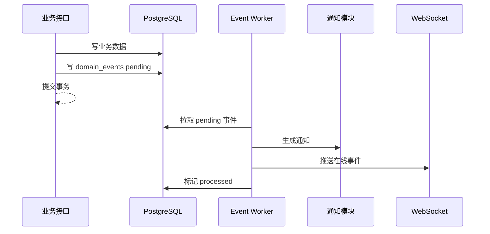

# 第一阶段技术设计：数据表、接口、事件与权限

## 1. 文档目的

本文档承接以下两份文档：

- [轻量协同工作平台 PRD + 技术架构草案](./light-colla-platform-prd-architecture.md)
- [第一阶段 MVP 需求清单与页面原型说明](./mvp-requirements-and-prototype.md)
- [技术选型确认](./technology-selection.md)
- [项目骨架设计与初始化方案](./project-skeleton-initialization.md)

本文档用于把第一阶段 MVP 转换为可工程落地的技术设计，重点覆盖：

- 数据表设计。
- REST API 设计。
- WebSocket 协议设计。
- 领域事件和通知模型。
- 权限模型和鉴权规则。
- 状态流转和关键一致性约束。

## 2. 设计假设

### 2.1 技术假设

- 主数据库：PostgreSQL。
- 缓存与实时状态：Redis。
- 文件存储：MinIO 或其他 S3 兼容对象存储。
- 服务形态：模块化单体。
- API 风格：REST + WebSocket。
- 主键：推荐使用 UUID 或雪花 ID。若团队无分布式 ID 经验，第一阶段可用 UUID。
- 时间字段：统一使用 `timestamptz`。
- 删除策略：业务数据优先软删除，文件对象延迟清理。

### 2.2 产品假设

- 第一阶段只服务一个内部团队，不做多租户。
- 仍保留 `workspace_id` 字段，方便后续支持多团队或多租户。
- 项目默认私有，非成员不可见，管理员除外。
- 项目创建时自动创建项目群。
- 任务、需求、Bug 使用统一 `issues` 表，通过 `issue_type` 区分。
- IM 第一阶段支持内部业务链接卡片，外部网页 metadata 预览后置。
- 平台协议必须支持 Web、桌面端、iOS、Android 多客户端接入和跨设备同步。
- 需求、任务、Bug、文档、表格、文件等核心对象必须提供统一对象摘要、权限判断和内部链接解析能力。
- 文档第一阶段不做实时协同，采用版本号 + 冲突检测。
- 多维表格第一阶段不做公式字段。
- 全局搜索保持 P1，不作为第一阶段 P0 强依赖。

## 3. 通用数据规范

### 3.1 通用字段

多数业务表建议包含以下字段：

| 字段 | 类型 | 说明 |
| --- | --- | --- |
| `id` | uuid | 主键 |
| `workspace_id` | uuid | 工作空间 ID，第一阶段固定一个 |
| `created_by` | uuid | 创建人 |
| `created_at` | timestamptz | 创建时间 |
| `updated_by` | uuid | 最后更新人 |
| `updated_at` | timestamptz | 最后更新时间 |
| `deleted_at` | timestamptz | 软删除时间 |

### 3.2 枚举命名

枚举值建议用小写蛇形：

- `active`
- `disabled`
- `project_owner`
- `project_member`
- `project_viewer`
- `direct`
- `group`
- `project`
- `system`

### 3.3 分页规范

列表接口统一支持：

- `page`
- `pageSize`
- `sort`
- `order`

历史消息、通知、动态日志等更适合游标分页：

- `beforeId`
- `afterId`
- `limit`

## 4. 数据表设计

### 4.1 工作空间与用户

#### `workspaces`

用于保留后续多团队能力。第一阶段只有一条默认数据。

| 字段 | 类型 | 说明 |
| --- | --- | --- |
| `id` | uuid | 主键 |
| `name` | varchar(128) | 工作空间名称 |
| `slug` | varchar(64) | 唯一标识 |
| `status` | varchar(32) | `active` / `disabled` |
| `created_at` | timestamptz | 创建时间 |
| `updated_at` | timestamptz | 更新时间 |

索引：

- `uk_workspaces_slug` unique(`slug`)

#### `users`

| 字段 | 类型 | 说明 |
| --- | --- | --- |
| `id` | uuid | 主键 |
| `workspace_id` | uuid | 工作空间 ID |
| `username` | varchar(64) | 登录账号 |
| `password_hash` | varchar(255) | 密码哈希 |
| `display_name` | varchar(64) | 显示名称 |
| `avatar_file_id` | uuid | 头像文件 |
| `email` | varchar(128) | 邮箱 |
| `phone` | varchar(32) | 手机号 |
| `department` | varchar(128) | 部门，第一阶段可先用文本 |
| `status` | varchar(32) | `active` / `disabled` |
| `last_login_at` | timestamptz | 最近登录时间 |
| `created_by` | uuid | 创建人 |
| `created_at` | timestamptz | 创建时间 |
| `updated_by` | uuid | 更新人 |
| `updated_at` | timestamptz | 更新时间 |
| `deleted_at` | timestamptz | 软删除时间 |

索引：

- `uk_users_workspace_username` unique(`workspace_id`, `username`)
- `idx_users_workspace_status` (`workspace_id`, `status`)

#### `sessions`

如采用 JWT + refresh token，可保存 refresh token 和登录设备。

| 字段 | 类型 | 说明 |
| --- | --- | --- |
| `id` | uuid | 主键 |
| `workspace_id` | uuid | 工作空间 ID |
| `user_id` | uuid | 用户 ID |
| `device_id` | uuid | 设备 ID |
| `refresh_token_hash` | varchar(255) | refresh token 哈希 |
| `user_agent` | text | 登录客户端 |
| `ip_address` | varchar(64) | IP |
| `expires_at` | timestamptz | 过期时间 |
| `revoked_at` | timestamptz | 撤销时间 |
| `created_at` | timestamptz | 创建时间 |

索引：

- `idx_sessions_user` (`user_id`, `created_at`)
- `idx_sessions_token` (`refresh_token_hash`)

#### `user_devices`

用于记录用户登录设备。IM 多端同步、移动推送和安全审计都依赖该表。

| 字段 | 类型 | 说明 |
| --- | --- | --- |
| `id` | uuid | 主键 |
| `workspace_id` | uuid | 工作空间 ID |
| `user_id` | uuid | 用户 ID |
| `device_type` | varchar(32) | `web` / `desktop` / `ios` / `android` |
| `device_name` | varchar(128) | 设备名称 |
| `device_fingerprint` | varchar(255) | 设备指纹或客户端生成 ID |
| `app_version` | varchar(64) | 客户端版本 |
| `last_active_at` | timestamptz | 最后活跃时间 |
| `created_at` | timestamptz | 创建时间 |
| `revoked_at` | timestamptz | 撤销时间 |

索引：

- `idx_user_devices_user` (`workspace_id`, `user_id`, `last_active_at`)
- `uk_user_devices_fingerprint` unique(`workspace_id`, `user_id`, `device_fingerprint`)

#### `push_tokens`

用于后续移动端系统推送。第一阶段可建表但不实现真实推送通道。

| 字段 | 类型 | 说明 |
| --- | --- | --- |
| `id` | uuid | 主键 |
| `workspace_id` | uuid | 工作空间 ID |
| `user_id` | uuid | 用户 ID |
| `device_id` | uuid | 设备 ID |
| `provider` | varchar(32) | `apns` / `fcm` / `vendor` |
| `token_hash` | varchar(255) | token 哈希，避免明文检索 |
| `token_encrypted` | text | 加密后的推送 token |
| `enabled` | boolean | 是否启用 |
| `created_at` | timestamptz | 创建时间 |
| `updated_at` | timestamptz | 更新时间 |
| `revoked_at` | timestamptz | 撤销时间 |

索引：

- `idx_push_tokens_user` (`workspace_id`, `user_id`, `enabled`)
- `idx_push_tokens_device` (`device_id`)

### 4.2 平台对象与链接

平台对象能力用于支撑 IM 卡片、通知跳转、工作台入口、搜索结果和移动端轻量视图。第一阶段不强制把所有业务对象写入统一实体表，但需要统一对象类型、链接解析和摘要接口。

#### 平台对象类型

| 类型 | 说明 |
| --- | --- |
| `issue` | 需求、任务、Bug |
| `document` | 文档 |
| `base` | 表格空间 |
| `base_table` | 数据表 |
| `base_record` | 表格记录 |
| `file` | 文件 |
| `notification` | 通知 |
| `approval_instance` | 后续审批实例 |

#### `object_links`

用于记录内部链接和目标对象的映射，便于跨端 deep link、IM 卡片、通知跳转和审计。业务对象本身仍存各自模块表。

| 字段 | 类型 | 说明 |
| --- | --- | --- |
| `id` | uuid | 主键 |
| `workspace_id` | uuid | 工作空间 ID |
| `object_type` | varchar(64) | 平台对象类型 |
| `object_id` | uuid | 业务对象 ID |
| `web_path` | varchar(512) | Web 路由路径 |
| `deep_link` | varchar(512) | `colla://` 内部协议链接 |
| `title_snapshot` | varchar(255) | 标题快照 |
| `created_at` | timestamptz | 创建时间 |
| `updated_at` | timestamptz | 更新时间 |
| `deleted_at` | timestamptz | 删除时间 |

索引：

- `uk_object_links_object` unique(`workspace_id`, `object_type`, `object_id`)
- `idx_object_links_deep_link` (`workspace_id`, `deep_link`)

### 4.3 角色与权限

#### `roles`

| 字段 | 类型 | 说明 |
| --- | --- | --- |
| `id` | uuid | 主键 |
| `workspace_id` | uuid | 工作空间 ID |
| `code` | varchar(64) | 角色编码 |
| `name` | varchar(64) | 角色名称 |
| `scope` | varchar(32) | `system` / `project` |
| `is_builtin` | boolean | 是否内置 |
| `created_at` | timestamptz | 创建时间 |
| `updated_at` | timestamptz | 更新时间 |

内置系统角色：

- `admin`
- `member`

内置项目角色：

- `project_owner`
- `project_member`
- `project_viewer`

#### `permissions`

| 字段 | 类型 | 说明 |
| --- | --- | --- |
| `id` | uuid | 主键 |
| `code` | varchar(128) | 权限编码 |
| `name` | varchar(128) | 权限名称 |
| `module` | varchar(64) | 所属模块 |
| `created_at` | timestamptz | 创建时间 |

权限编码示例：

- `admin.access`
- `user.manage`
- `project.create`
- `project.manage`
- `issue.create`
- `issue.update`
- `doc.create`
- `doc.update`
- `base.create`
- `base.update`

#### `role_permissions`

| 字段 | 类型 | 说明 |
| --- | --- | --- |
| `role_id` | uuid | 角色 ID |
| `permission_id` | uuid | 权限 ID |

#### `user_roles`

系统级角色绑定。

| 字段 | 类型 | 说明 |
| --- | --- | --- |
| `id` | uuid | 主键 |
| `workspace_id` | uuid | 工作空间 ID |
| `user_id` | uuid | 用户 ID |
| `role_id` | uuid | 角色 ID |
| `created_by` | uuid | 创建人 |
| `created_at` | timestamptz | 创建时间 |

#### `resource_permissions`

资源级授权，用于文档、表格空间等。

| 字段 | 类型 | 说明 |
| --- | --- | --- |
| `id` | uuid | 主键 |
| `workspace_id` | uuid | 工作空间 ID |
| `resource_type` | varchar(64) | `document` / `base` / `base_table` |
| `resource_id` | uuid | 资源 ID |
| `subject_type` | varchar(32) | `user` / `role` / `project` |
| `subject_id` | uuid | 授权主体 ID |
| `permission_level` | varchar(32) | `view` / `comment` / `edit` / `manage` |
| `created_by` | uuid | 创建人 |
| `created_at` | timestamptz | 创建时间 |

索引：

- `idx_resource_permissions_lookup` (`resource_type`, `resource_id`, `subject_type`, `subject_id`)

### 4.4 IM

#### `conversations`

| 字段 | 类型 | 说明 |
| --- | --- | --- |
| `id` | uuid | 主键 |
| `workspace_id` | uuid | 工作空间 ID |
| `conversation_type` | varchar(32) | `direct` / `group` / `project` / `system` |
| `name` | varchar(128) | 会话名称 |
| `avatar_file_id` | uuid | 会话头像 |
| `project_id` | uuid | 项目群关联项目 |
| `created_by` | uuid | 创建人 |
| `created_at` | timestamptz | 创建时间 |
| `updated_at` | timestamptz | 更新时间 |
| `last_message_id` | uuid | 最后一条消息 |
| `last_message_at` | timestamptz | 最后消息时间 |
| `deleted_at` | timestamptz | 软删除时间 |

索引：

- `idx_conversations_workspace_last_message` (`workspace_id`, `last_message_at`)
- `idx_conversations_project` (`project_id`)

#### `conversation_members`

| 字段 | 类型 | 说明 |
| --- | --- | --- |
| `id` | uuid | 主键 |
| `workspace_id` | uuid | 工作空间 ID |
| `conversation_id` | uuid | 会话 ID |
| `user_id` | uuid | 成员 ID |
| `role` | varchar(32) | `owner` / `member` |
| `joined_at` | timestamptz | 加入时间 |
| `muted` | boolean | 是否免打扰 |
| `last_read_message_id` | uuid | 最后已读消息 |
| `last_read_at` | timestamptz | 最后已读时间 |
| `deleted_at` | timestamptz | 退出时间 |

索引：

- `uk_conversation_members` unique(`conversation_id`, `user_id`)
- `idx_conversation_members_user` (`workspace_id`, `user_id`)

#### `messages`

| 字段 | 类型 | 说明 |
| --- | --- | --- |
| `id` | uuid | 主键 |
| `workspace_id` | uuid | 工作空间 ID |
| `conversation_id` | uuid | 会话 ID |
| `sender_id` | uuid | 发送人 |
| `client_message_id` | varchar(128) | 客户端临时消息 ID |
| `message_type` | varchar(32) | `text` / `file` / `system` / `card` |
| `content` | jsonb | 消息内容 |
| `reply_to_message_id` | uuid | 回复消息，P1 |
| `status` | varchar(32) | `normal` / `deleted` |
| `created_at` | timestamptz | 发送时间 |
| `updated_at` | timestamptz | 更新时间 |

`content` 示例：

```json
{
  "text": "请看一下这个 Bug @李四",
  "mentions": ["user-id"],
  "files": ["file-id"],
  "links": [
    {
      "url": "https://colla.local/issues/BUG-12",
      "targetType": "issue",
      "targetId": "issue-id"
    }
  ],
  "cards": [
    {
      "targetType": "issue",
      "targetId": "issue-id",
      "snapshot": {
        "title": "BUG-12 登录失败",
        "status": "fixing",
        "assigneeName": "李四"
      }
    }
  ]
}
```

索引：

- `idx_messages_conversation_created` (`conversation_id`, `created_at`)
- `uk_messages_client_id` unique(`conversation_id`, `sender_id`, `client_message_id`)

#### `message_mentions`

| 字段 | 类型 | 说明 |
| --- | --- | --- |
| `id` | uuid | 主键 |
| `workspace_id` | uuid | 工作空间 ID |
| `message_id` | uuid | 消息 ID |
| `mentioned_user_id` | uuid | 被 @用户 |
| `created_at` | timestamptz | 创建时间 |

#### `message_attachments`

| 字段 | 类型 | 说明 |
| --- | --- | --- |
| `id` | uuid | 主键 |
| `workspace_id` | uuid | 工作空间 ID |
| `message_id` | uuid | 消息 ID |
| `file_id` | uuid | 文件 ID |
| `created_at` | timestamptz | 创建时间 |

#### `message_links`

用于保存消息中的内部业务对象链接和卡片快照。外部网页链接第一阶段只保留原始文本，不抓取 metadata。

| 字段 | 类型 | 说明 |
| --- | --- | --- |
| `id` | uuid | 主键 |
| `workspace_id` | uuid | 工作空间 ID |
| `message_id` | uuid | 消息 ID |
| `url` | text | 原始链接 |
| `target_type` | varchar(64) | `issue` / `document` / `base` / `base_table` / `base_record` |
| `target_id` | uuid | 目标对象 ID |
| `title_snapshot` | varchar(255) | 发送时标题快照 |
| `summary_snapshot` | text | 发送时摘要快照 |
| `metadata_json` | jsonb | 状态、负责人、更新时间等快照 |
| `resolve_status` | varchar(32) | `resolved` / `unresolved` / `deleted` |
| `created_at` | timestamptz | 创建时间 |

索引：

- `idx_message_links_message` (`message_id`)
- `idx_message_links_target` (`target_type`, `target_id`)

### 4.5 项目、任务与 Bug

#### `projects`

| 字段 | 类型 | 说明 |
| --- | --- | --- |
| `id` | uuid | 主键 |
| `workspace_id` | uuid | 工作空间 ID |
| `name` | varchar(128) | 项目名称 |
| `description` | text | 项目描述 |
| `owner_id` | uuid | 项目负责人 |
| `status` | varchar(32) | `active` / `archived` |
| `visibility` | varchar(32) | `private` / `workspace` |
| `conversation_id` | uuid | 项目群 |
| `created_by` | uuid | 创建人 |
| `created_at` | timestamptz | 创建时间 |
| `updated_by` | uuid | 更新人 |
| `updated_at` | timestamptz | 更新时间 |
| `deleted_at` | timestamptz | 软删除时间 |

索引：

- `idx_projects_workspace_status` (`workspace_id`, `status`)

#### `project_members`

| 字段 | 类型 | 说明 |
| --- | --- | --- |
| `id` | uuid | 主键 |
| `workspace_id` | uuid | 工作空间 ID |
| `project_id` | uuid | 项目 ID |
| `user_id` | uuid | 用户 ID |
| `role` | varchar(32) | `project_owner` / `project_member` / `project_viewer` |
| `joined_at` | timestamptz | 加入时间 |
| `created_by` | uuid | 创建人 |
| `deleted_at` | timestamptz | 移除时间 |

索引：

- `uk_project_members` unique(`project_id`, `user_id`)
- `idx_project_members_user` (`workspace_id`, `user_id`)

#### `iterations`

| 字段 | 类型 | 说明 |
| --- | --- | --- |
| `id` | uuid | 主键 |
| `workspace_id` | uuid | 工作空间 ID |
| `project_id` | uuid | 项目 ID |
| `name` | varchar(128) | 迭代名称 |
| `status` | varchar(32) | `planned` / `active` / `done` |
| `start_date` | date | 开始日期 |
| `end_date` | date | 结束日期 |
| `created_by` | uuid | 创建人 |
| `created_at` | timestamptz | 创建时间 |
| `updated_by` | uuid | 更新人 |
| `updated_at` | timestamptz | 更新时间 |

#### `issues`

统一承载需求、任务和 Bug。

| 字段 | 类型 | 说明 |
| --- | --- | --- |
| `id` | uuid | 主键 |
| `workspace_id` | uuid | 工作空间 ID |
| `project_id` | uuid | 项目 ID |
| `iteration_id` | uuid | 迭代 ID |
| `issue_key` | varchar(32) | 项目内可读编号，例如 `BUG-12` |
| `issue_type` | varchar(32) | `requirement` / `task` / `bug` |
| `title` | varchar(255) | 标题 |
| `description` | text | 描述 |
| `status` | varchar(32) | 状态 |
| `priority` | varchar(32) | `low` / `medium` / `high` / `urgent` |
| `assignee_id` | uuid | 负责人 |
| `reporter_id` | uuid | 创建/报告人 |
| `due_date` | date | 截止日期 |
| `labels` | jsonb | 标签数组 |
| `sort_order` | numeric | 看板排序 |
| `created_by` | uuid | 创建人 |
| `created_at` | timestamptz | 创建时间 |
| `updated_by` | uuid | 更新人 |
| `updated_at` | timestamptz | 更新时间 |
| `closed_at` | timestamptz | 关闭时间 |
| `deleted_at` | timestamptz | 软删除时间 |

索引：

- `uk_issues_project_key` unique(`project_id`, `issue_key`)
- `idx_issues_project_status` (`project_id`, `status`)
- `idx_issues_assignee` (`workspace_id`, `assignee_id`, `status`)
- `idx_issues_updated` (`workspace_id`, `updated_at`)

#### `issue_comments`

| 字段 | 类型 | 说明 |
| --- | --- | --- |
| `id` | uuid | 主键 |
| `workspace_id` | uuid | 工作空间 ID |
| `issue_id` | uuid | 事项 ID |
| `author_id` | uuid | 评论人 |
| `content` | text | 评论内容 |
| `mentions` | jsonb | 被 @用户 ID 数组 |
| `created_at` | timestamptz | 创建时间 |
| `updated_at` | timestamptz | 更新时间 |
| `deleted_at` | timestamptz | 删除时间 |

#### `issue_attachments`

| 字段 | 类型 | 说明 |
| --- | --- | --- |
| `id` | uuid | 主键 |
| `workspace_id` | uuid | 工作空间 ID |
| `issue_id` | uuid | 事项 ID |
| `file_id` | uuid | 文件 ID |
| `created_by` | uuid | 上传人 |
| `created_at` | timestamptz | 创建时间 |

#### `issue_relations`

用于关联文档、表格记录、来源消息等。

| 字段 | 类型 | 说明 |
| --- | --- | --- |
| `id` | uuid | 主键 |
| `workspace_id` | uuid | 工作空间 ID |
| `issue_id` | uuid | 事项 ID |
| `target_type` | varchar(64) | `document` / `base_record` / `message` / `issue` |
| `target_id` | uuid | 目标 ID |
| `relation_type` | varchar(64) | `relates_to` / `blocks` / `source` |
| `created_by` | uuid | 创建人 |
| `created_at` | timestamptz | 创建时间 |

#### `issue_activity_logs`

| 字段 | 类型 | 说明 |
| --- | --- | --- |
| `id` | uuid | 主键 |
| `workspace_id` | uuid | 工作空间 ID |
| `issue_id` | uuid | 事项 ID |
| `actor_id` | uuid | 操作人 |
| `action` | varchar(64) | `created` / `updated` / `transitioned` / `commented` |
| `old_value` | jsonb | 旧值 |
| `new_value` | jsonb | 新值 |
| `created_at` | timestamptz | 创建时间 |

### 4.6 文档

#### `documents`

| 字段 | 类型 | 说明 |
| --- | --- | --- |
| `id` | uuid | 主键 |
| `workspace_id` | uuid | 工作空间 ID |
| `parent_id` | uuid | 父目录或父文档，第一阶段可用于目录树 |
| `doc_type` | varchar(32) | `doc` / `folder` |
| `title` | varchar(255) | 标题 |
| `content_format` | varchar(32) | `markdown` / `rich_text_json` |
| `current_version_id` | uuid | 当前版本 |
| `version_no` | integer | 当前版本号 |
| `owner_id` | uuid | 所有人 |
| `created_by` | uuid | 创建人 |
| `created_at` | timestamptz | 创建时间 |
| `updated_by` | uuid | 更新人 |
| `updated_at` | timestamptz | 更新时间 |
| `deleted_at` | timestamptz | 软删除时间 |

索引：

- `idx_documents_parent` (`workspace_id`, `parent_id`)
- `idx_documents_updated` (`workspace_id`, `updated_at`)

#### `document_versions`

| 字段 | 类型 | 说明 |
| --- | --- | --- |
| `id` | uuid | 主键 |
| `workspace_id` | uuid | 工作空间 ID |
| `document_id` | uuid | 文档 ID |
| `version_no` | integer | 版本号 |
| `title` | varchar(255) | 版本标题 |
| `content` | text | 文档内容 |
| `content_json` | jsonb | 富文本结构，按编辑器选择 |
| `created_by` | uuid | 保存人 |
| `created_at` | timestamptz | 保存时间 |

索引：

- `uk_document_versions` unique(`document_id`, `version_no`)

#### `document_comments`

P1 可实现，表结构先预留。

| 字段 | 类型 | 说明 |
| --- | --- | --- |
| `id` | uuid | 主键 |
| `workspace_id` | uuid | 工作空间 ID |
| `document_id` | uuid | 文档 ID |
| `anchor` | jsonb | 评论定位 |
| `author_id` | uuid | 评论人 |
| `content` | text | 评论内容 |
| `mentions` | jsonb | 被 @用户 ID 数组 |
| `status` | varchar(32) | `open` / `resolved` |
| `created_at` | timestamptz | 创建时间 |
| `updated_at` | timestamptz | 更新时间 |

#### `document_relations`

| 字段 | 类型 | 说明 |
| --- | --- | --- |
| `id` | uuid | 主键 |
| `workspace_id` | uuid | 工作空间 ID |
| `document_id` | uuid | 文档 ID |
| `target_type` | varchar(64) | `project` / `issue` / `base_record` |
| `target_id` | uuid | 目标 ID |
| `created_by` | uuid | 创建人 |
| `created_at` | timestamptz | 创建时间 |

### 4.7 多维表格

#### `bases`

表格空间。

| 字段 | 类型 | 说明 |
| --- | --- | --- |
| `id` | uuid | 主键 |
| `workspace_id` | uuid | 工作空间 ID |
| `name` | varchar(128) | 空间名称 |
| `description` | text | 描述 |
| `owner_id` | uuid | 所有人 |
| `created_by` | uuid | 创建人 |
| `created_at` | timestamptz | 创建时间 |
| `updated_by` | uuid | 更新人 |
| `updated_at` | timestamptz | 更新时间 |
| `deleted_at` | timestamptz | 删除时间 |

#### `base_tables`

| 字段 | 类型 | 说明 |
| --- | --- | --- |
| `id` | uuid | 主键 |
| `workspace_id` | uuid | 工作空间 ID |
| `base_id` | uuid | 表格空间 ID |
| `name` | varchar(128) | 数据表名称 |
| `description` | text | 描述 |
| `sort_order` | integer | 排序 |
| `created_by` | uuid | 创建人 |
| `created_at` | timestamptz | 创建时间 |
| `updated_by` | uuid | 更新人 |
| `updated_at` | timestamptz | 更新时间 |
| `deleted_at` | timestamptz | 删除时间 |

#### `base_fields`

| 字段 | 类型 | 说明 |
| --- | --- | --- |
| `id` | uuid | 主键 |
| `workspace_id` | uuid | 工作空间 ID |
| `table_id` | uuid | 数据表 ID |
| `name` | varchar(128) | 字段名 |
| `field_type` | varchar(32) | 字段类型 |
| `config` | jsonb | 字段配置，例如选项列表 |
| `required` | boolean | 是否必填 |
| `sort_order` | integer | 字段顺序 |
| `created_by` | uuid | 创建人 |
| `created_at` | timestamptz | 创建时间 |
| `updated_by` | uuid | 更新人 |
| `updated_at` | timestamptz | 更新时间 |
| `deleted_at` | timestamptz | 删除时间 |

`field_type` 第一阶段可用值：

- `text`
- `long_text`
- `number`
- `single_select`
- `multi_select`
- `date`
- `member`
- `attachment`
- `checkbox`
- `url`

#### `base_records`

| 字段 | 类型 | 说明 |
| --- | --- | --- |
| `id` | uuid | 主键 |
| `workspace_id` | uuid | 工作空间 ID |
| `table_id` | uuid | 数据表 ID |
| `sort_order` | numeric | 排序 |
| `created_by` | uuid | 创建人 |
| `created_at` | timestamptz | 创建时间 |
| `updated_by` | uuid | 更新人 |
| `updated_at` | timestamptz | 更新时间 |
| `deleted_at` | timestamptz | 删除时间 |

索引：

- `idx_base_records_table` (`table_id`, `created_at`)

#### `base_record_values`

单元格值。为第一阶段简单实现，可使用 `value_json` 统一承载，配合字段类型做服务端校验。

| 字段 | 类型 | 说明 |
| --- | --- | --- |
| `id` | uuid | 主键 |
| `workspace_id` | uuid | 工作空间 ID |
| `table_id` | uuid | 冗余表 ID，便于查询 |
| `record_id` | uuid | 记录 ID |
| `field_id` | uuid | 字段 ID |
| `value_json` | jsonb | 单元格值 |
| `value_text` | text | 文本冗余，便于简单搜索 |
| `value_number` | numeric | 数字冗余，便于筛选排序 |
| `value_date` | date | 日期冗余，便于筛选排序 |
| `updated_by` | uuid | 更新人 |
| `updated_at` | timestamptz | 更新时间 |

索引：

- `uk_base_record_values` unique(`record_id`, `field_id`)
- `idx_base_record_values_field_text` (`field_id`, `value_text`)
- `idx_base_record_values_field_number` (`field_id`, `value_number`)
- `idx_base_record_values_field_date` (`field_id`, `value_date`)

#### `base_views`

| 字段 | 类型 | 说明 |
| --- | --- | --- |
| `id` | uuid | 主键 |
| `workspace_id` | uuid | 工作空间 ID |
| `table_id` | uuid | 数据表 ID |
| `name` | varchar(128) | 视图名称 |
| `view_type` | varchar(32) | `grid` |
| `config` | jsonb | 筛选、排序、列宽、隐藏列 |
| `created_by` | uuid | 创建人 |
| `created_at` | timestamptz | 创建时间 |
| `updated_by` | uuid | 更新人 |
| `updated_at` | timestamptz | 更新时间 |
| `deleted_at` | timestamptz | 删除时间 |

### 4.8 通知

#### `notifications`

| 字段 | 类型 | 说明 |
| --- | --- | --- |
| `id` | uuid | 主键 |
| `workspace_id` | uuid | 工作空间 ID |
| `recipient_id` | uuid | 接收人 |
| `actor_id` | uuid | 触发人，可为空 |
| `notification_type` | varchar(64) | 通知类型 |
| `title` | varchar(255) | 标题 |
| `content` | text | 内容 |
| `target_type` | varchar(64) | 目标对象类型 |
| `target_id` | uuid | 目标对象 ID |
| `event_id` | uuid | 领域事件 ID |
| `read_at` | timestamptz | 已读时间 |
| `created_at` | timestamptz | 创建时间 |

索引：

- `idx_notifications_recipient_unread` (`recipient_id`, `read_at`, `created_at`)
- `idx_notifications_event` (`event_id`)

#### `domain_events`

第一阶段可直接存在主库，后续可迁移到消息队列或 outbox。

| 字段 | 类型 | 说明 |
| --- | --- | --- |
| `id` | uuid | 主键 |
| `workspace_id` | uuid | 工作空间 ID |
| `event_type` | varchar(128) | 事件类型 |
| `aggregate_type` | varchar(64) | 聚合类型 |
| `aggregate_id` | uuid | 聚合 ID |
| `actor_id` | uuid | 触发人 |
| `payload` | jsonb | 事件负载 |
| `status` | varchar(32) | `pending` / `processed` / `failed` |
| `created_at` | timestamptz | 创建时间 |
| `processed_at` | timestamptz | 处理时间 |

索引：

- `idx_domain_events_status` (`status`, `created_at`)
- `idx_domain_events_aggregate` (`aggregate_type`, `aggregate_id`)

### 4.9 文件

#### `files`

| 字段 | 类型 | 说明 |
| --- | --- | --- |
| `id` | uuid | 主键 |
| `workspace_id` | uuid | 工作空间 ID |
| `bucket` | varchar(128) | 存储桶 |
| `object_key` | varchar(512) | 对象 key |
| `original_name` | varchar(255) | 原始文件名 |
| `mime_type` | varchar(128) | MIME 类型 |
| `size_bytes` | bigint | 文件大小 |
| `sha256` | varchar(128) | 文件哈希 |
| `uploaded_by` | uuid | 上传人 |
| `created_at` | timestamptz | 上传时间 |
| `deleted_at` | timestamptz | 删除时间 |

#### `file_usages`

| 字段 | 类型 | 说明 |
| --- | --- | --- |
| `id` | uuid | 主键 |
| `workspace_id` | uuid | 工作空间 ID |
| `file_id` | uuid | 文件 ID |
| `target_type` | varchar(64) | `message` / `issue` / `document` / `base_record` |
| `target_id` | uuid | 目标 ID |
| `created_by` | uuid | 创建人 |
| `created_at` | timestamptz | 创建时间 |

### 4.10 审计日志

#### `audit_logs`

| 字段 | 类型 | 说明 |
| --- | --- | --- |
| `id` | uuid | 主键 |
| `workspace_id` | uuid | 工作空间 ID |
| `actor_id` | uuid | 操作人 |
| `action` | varchar(128) | 操作 |
| `target_type` | varchar(64) | 目标类型 |
| `target_id` | uuid | 目标 ID |
| `ip_address` | varchar(64) | IP |
| `user_agent` | text | 客户端 |
| `metadata` | jsonb | 附加数据 |
| `created_at` | timestamptz | 创建时间 |

## 5. REST API 设计

### 5.1 通用响应

成功响应：

```json
{
  "data": {},
  "requestId": "req-id"
}
```

分页响应：

```json
{
  "data": [],
  "page": 1,
  "pageSize": 20,
  "total": 120,
  "requestId": "req-id"
}
```

错误响应：

```json
{
  "error": {
    "code": "permission_denied",
    "message": "没有权限执行该操作"
  },
  "requestId": "req-id"
}
```

### 5.2 认证与用户

| 方法 | 路径 | 说明 | 权限 |
| --- | --- | --- | --- |
| POST | `/api/auth/login` | 登录 | 匿名 |
| POST | `/api/auth/refresh` | 刷新 token | 登录用户 |
| POST | `/api/auth/logout` | 退出登录 | 登录用户 |
| POST | `/api/devices/register` | 注册或更新当前设备 | 登录用户 |
| GET | `/api/devices` | 当前用户设备列表 | 登录用户 |
| DELETE | `/api/devices/{id}` | 撤销设备 | 设备本人或管理员 |
| POST | `/api/devices/{id}/push-token` | 绑定移动推送 token | 设备本人 |
| GET | `/api/users/me` | 当前用户信息 | 登录用户 |
| GET | `/api/users` | 成员列表 | `user.view` |
| POST | `/api/users` | 创建成员 | `user.manage` |
| GET | `/api/users/{id}` | 成员详情 | `user.view` |
| PATCH | `/api/users/{id}` | 更新成员 | `user.manage` |
| POST | `/api/users/{id}/disable` | 禁用成员 | `user.manage` |
| POST | `/api/users/{id}/enable` | 启用成员 | `user.manage` |

登录请求：

```json
{
  "username": "zhangsan",
  "password": "password",
  "device": {
    "deviceType": "web",
    "deviceName": "Chrome on Windows",
    "deviceFingerprint": "client-generated-id",
    "appVersion": "0.1.0"
  }
}
```

登录响应：

```json
{
  "data": {
    "accessToken": "jwt",
    "refreshToken": "refresh-token",
    "user": {
      "id": "user-id",
      "username": "zhangsan",
      "displayName": "张三",
      "roles": ["member"]
    }
  }
}
```

### 5.3 平台对象与链接

| 方法 | 路径 | 说明 | 权限 |
| --- | --- | --- | --- |
| POST | `/api/platform/links/resolve` | 解析内部链接为平台对象 | 登录用户 |
| GET | `/api/platform/objects/{type}/{id}/summary` | 获取对象摘要 | 目标对象 view |
| POST | `/api/platform/objects/summaries` | 批量获取对象摘要 | 按对象逐个鉴权 |
| GET | `/api/platform/objects/{type}/{id}/link` | 获取对象 Web/deep link | 目标对象 view |

对象摘要响应：

```json
{
  "data": {
    "objectType": "issue",
    "objectId": "issue-id",
    "title": "BUG-12 登录失败",
    "summary": "输入正确账号密码后仍提示失败",
    "metadata": {
      "status": "fixing",
      "assigneeName": "李四",
      "updatedAt": "2026-06-13T10:00:00Z"
    },
    "links": {
      "web": "/issues/issue-id",
      "deepLink": "colla://issue/issue-id"
    },
    "visible": true,
    "deleted": false
  }
}
```

### 5.4 会话与消息

| 方法 | 路径 | 说明 | 权限 |
| --- | --- | --- | --- |
| GET | `/api/conversations` | 会话列表 | 会话成员 |
| POST | `/api/conversations` | 创建群聊 | 登录用户 |
| GET | `/api/conversations/{id}` | 会话详情 | 会话成员 |
| GET | `/api/conversations/{id}/messages` | 消息历史 | 会话成员 |
| POST | `/api/conversations/{id}/messages` | 发送消息 | 会话成员 |
| GET | `/api/messages/{messageId}/cards` | 获取消息卡片详情 | 会话成员 + 目标对象权限 |
| POST | `/api/link-previews/resolve` | 预解析内部业务链接 | 登录用户 |
| POST | `/api/conversations/{id}/read` | 标记已读 | 会话成员 |
| GET | `/api/conversations/{id}/members` | 会话成员 | 会话成员 |
| POST | `/api/conversations/{id}/members` | 添加成员 | 会话 owner |

发送消息请求：

```json
{
  "clientMessageId": "local-uuid",
  "messageType": "text",
  "content": {
    "text": "请看一下 @李四 https://colla.local/issues/BUG-12",
    "mentions": ["user-id"],
    "links": [
      "https://colla.local/issues/BUG-12"
    ]
  }
}
```

内部链接预解析请求：

```json
{
  "url": "https://colla.local/issues/BUG-12"
}
```

内部链接预解析响应：

```json
{
  "data": {
    "targetType": "issue",
    "targetId": "issue-id",
    "visible": true,
    "card": {
      "title": "BUG-12 登录失败",
      "summary": "输入正确账号密码后仍提示失败",
      "metadata": {
        "status": "fixing",
        "assigneeName": "李四",
        "updatedAt": "2026-06-13T10:00:00Z"
      }
    }
  }
}
```

消息卡片详情响应需要按当前用户权限返回：

```json
{
  "data": [
    {
      "targetType": "issue",
      "targetId": "issue-id",
      "visible": true,
      "deleted": false,
      "title": "BUG-12 登录失败",
      "summary": "输入正确账号密码后仍提示失败",
      "metadata": {
        "status": "fixing",
        "assigneeName": "李四"
      },
      "url": "/issues/issue-id"
    }
  ]
}
```

### 5.5 项目与事项

| 方法 | 路径 | 说明 | 权限 |
| --- | --- | --- | --- |
| GET | `/api/projects` | 项目列表 | 登录用户，按权限过滤 |
| POST | `/api/projects` | 创建项目 | `project.create` |
| GET | `/api/projects/{id}` | 项目详情 | 项目可见 |
| PATCH | `/api/projects/{id}` | 更新项目 | 项目负责人 |
| GET | `/api/projects/{id}/members` | 项目成员 | 项目可见 |
| POST | `/api/projects/{id}/members` | 添加成员 | 项目负责人 |
| DELETE | `/api/projects/{id}/members/{userId}` | 移除成员 | 项目负责人 |
| GET | `/api/projects/{id}/issues` | 事项列表 | 项目可见 |
| POST | `/api/projects/{id}/issues` | 创建事项 | 项目成员 |
| GET | `/api/issues/{id}` | 事项详情 | 项目可见 |
| PATCH | `/api/issues/{id}` | 更新事项 | 项目成员 |
| POST | `/api/issues/{id}/transition` | 状态流转 | 项目成员 |
| GET | `/api/issues/{id}/comments` | 评论列表 | 项目可见 |
| POST | `/api/issues/{id}/comments` | 新增评论 | 项目成员 |
| POST | `/api/issues/{id}/attachments` | 添加附件 | 项目成员 |
| POST | `/api/issues/{id}/relations` | 添加关联 | 项目成员 |
| GET | `/api/my/issues` | 我的事项 | 登录用户 |

创建事项请求：

```json
{
  "issueType": "bug",
  "title": "登录失败",
  "description": "输入正确账号密码后仍提示失败",
  "priority": "high",
  "assigneeId": "user-id",
  "dueDate": "2026-06-20",
  "labels": ["登录"]
}
```

状态流转请求：

```json
{
  "targetStatus": "in_progress",
  "comment": "开始处理"
}
```

### 5.6 文档

| 方法 | 路径 | 说明 | 权限 |
| --- | --- | --- | --- |
| GET | `/api/docs` | 文档列表 | 按权限过滤 |
| POST | `/api/docs` | 新建文档或目录 | `doc.create` |
| GET | `/api/docs/{id}` | 文档详情 | 文档 view |
| PATCH | `/api/docs/{id}` | 更新标题或目录 | 文档 edit |
| PUT | `/api/docs/{id}/content` | 保存内容 | 文档 edit |
| GET | `/api/docs/{id}/versions` | 版本列表 | 文档 view |
| POST | `/api/docs/{id}/versions/{versionId}/restore` | 恢复版本 | 文档 edit |
| GET | `/api/docs/{id}/relations` | 文档关联 | 文档 view |
| POST | `/api/docs/{id}/relations` | 添加关联 | 文档 edit |
| GET | `/api/docs/{id}/permissions` | 权限列表 | 文档 manage |
| PUT | `/api/docs/{id}/permissions` | 设置权限 | 文档 manage |

保存内容请求：

```json
{
  "baseVersionNo": 3,
  "title": "IM 模块设计",
  "contentFormat": "markdown",
  "content": "# 背景\n..."
}
```

冲突响应：

```json
{
  "error": {
    "code": "version_conflict",
    "message": "文档已被其他人更新，请刷新后合并"
  },
  "data": {
    "currentVersionNo": 4
  }
}
```

### 5.7 多维表格

| 方法 | 路径 | 说明 | 权限 |
| --- | --- | --- | --- |
| GET | `/api/bases` | 表格空间列表 | 按权限过滤 |
| POST | `/api/bases` | 创建表格空间 | `base.create` |
| GET | `/api/bases/{id}` | 表格空间详情 | base view |
| PATCH | `/api/bases/{id}` | 更新表格空间 | base manage |
| GET | `/api/bases/{id}/tables` | 数据表列表 | base view |
| POST | `/api/bases/{id}/tables` | 创建数据表 | base edit |
| GET | `/api/tables/{tableId}/fields` | 字段列表 | table view |
| POST | `/api/tables/{tableId}/fields` | 新增字段 | table edit |
| PATCH | `/api/fields/{fieldId}` | 更新字段 | table edit |
| DELETE | `/api/fields/{fieldId}` | 删除字段 | table edit |
| GET | `/api/tables/{tableId}/records` | 记录列表 | table view |
| POST | `/api/tables/{tableId}/records` | 新增记录 | table edit |
| PATCH | `/api/records/{recordId}` | 更新记录 | table edit |
| DELETE | `/api/records/{recordId}` | 删除记录 | table edit |
| GET | `/api/tables/{tableId}/views` | 视图列表 | table view |
| POST | `/api/tables/{tableId}/views` | 保存视图 | table edit |

新增字段请求：

```json
{
  "name": "状态",
  "fieldType": "single_select",
  "required": false,
  "config": {
    "options": [
      { "id": "todo", "name": "待处理", "color": "gray" },
      { "id": "doing", "name": "处理中", "color": "blue" }
    ]
  }
}
```

新增记录请求：

```json
{
  "values": {
    "field-title-id": "登录优化",
    "field-status-id": "todo",
    "field-owner-id": ["user-id"]
  }
}
```

记录列表查询：

```json
{
  "filters": [
    {
      "fieldId": "field-status-id",
      "operator": "eq",
      "value": "todo"
    }
  ],
  "sorts": [
    {
      "fieldId": "field-due-date-id",
      "order": "asc"
    }
  ],
  "page": 1,
  "pageSize": 50
}
```

实际接口可用 GET 查询参数或 POST `/query`。如果筛选条件复杂，建议使用：

- `POST /api/tables/{tableId}/records/query`

### 5.8 通知

| 方法 | 路径 | 说明 | 权限 |
| --- | --- | --- | --- |
| GET | `/api/notifications` | 通知列表 | 登录用户 |
| POST | `/api/notifications/{id}/read` | 标记单条已读 | 通知接收人 |
| POST | `/api/notifications/read-all` | 全部已读 | 登录用户 |
| GET | `/api/notifications/unread-count` | 未读数 | 登录用户 |

### 5.9 文件

| 方法 | 路径 | 说明 | 权限 |
| --- | --- | --- | --- |
| POST | `/api/files/upload-url` | 获取上传地址 | 登录用户 |
| POST | `/api/files/complete` | 完成上传登记 | 登录用户 |
| GET | `/api/files/{id}` | 文件元数据 | 有业务对象权限 |
| GET | `/api/files/{id}/download-url` | 获取下载地址 | 有业务对象权限 |

文件上传建议流程：

1. 客户端请求上传地址。
2. 客户端直传对象存储。
3. 客户端调用 complete 创建 `files` 记录。
4. 业务接口绑定文件引用。

## 6. WebSocket 协议设计

### 6.1 连接

连接地址：

```text
wss://host/ws?token=access-token&deviceId=device-id&clientType=web
```

连接成功后服务端返回：

```json
{
  "type": "connection.ack",
  "payload": {
    "userId": "user-id",
    "deviceId": "device-id",
    "clientType": "web",
    "serverTime": "2026-06-13T10:00:00Z"
  }
}
```

### 6.2 客户端发送事件

| 类型 | 说明 |
| --- | --- |
| `ping` | 心跳 |
| `message.send` | 发送消息，也可只用 REST 发送 |
| `conversation.read` | 会话已读 |
| `typing.start` | 正在输入，P1 |
| `typing.stop` | 停止输入，P1 |

第一阶段推荐消息发送仍走 REST，WebSocket 主要负责服务端推送。这样发送链路更容易保证持久化和鉴权一致。

### 6.3 服务端推送事件

| 类型 | 说明 |
| --- | --- |
| `message.created` | 新消息 |
| `conversation.updated` | 会话最后消息、未读数变化 |
| `notification.created` | 新通知 |
| `issue.updated` | 事项更新，当前打开页面可刷新 |
| `conversation.read` | 会话已读状态变化，跨设备同步 |
| `unread.changed` | 未读数变化 |
| `presence.updated` | 在线状态，P1 |

`message.created` 示例：

```json
{
  "type": "message.created",
  "eventId": "event-id",
  "payload": {
    "conversationId": "conversation-id",
    "message": {
      "id": "message-id",
      "senderId": "user-id",
      "messageType": "text",
      "content": {
        "text": "请看一下 @李四",
        "mentions": ["user-id-2"],
        "cards": [
          {
            "targetType": "issue",
            "targetId": "issue-id",
            "snapshot": {
              "title": "BUG-12 登录失败",
              "status": "fixing"
            }
          }
        ]
      },
      "createdAt": "2026-06-13T10:00:00Z"
    }
  }
}
```

### 6.4 断线补偿

客户端重连后需要：

1. 调用 `GET /api/conversations` 刷新会话列表和未读数。
2. 对当前打开会话调用 `GET /api/conversations/{id}/messages?afterId=lastMessageId` 补拉消息。
3. 调用 `GET /api/notifications/unread-count` 刷新通知角标。

### 6.5 多客户端同步

多客户端同步规则：

- 同一用户允许多个设备同时在线。
- 消息推送按用户维度 fanout 到所有在线设备，发送消息的设备也接收服务端确认后的正式消息。
- 会话已读按用户维度生效，不按设备分裂。
- 某设备标记已读后，服务端向该用户其他在线设备推送 `conversation.read` 和 `unread.changed`。
- 移动端离线时不依赖 WebSocket 常驻，后续通过 push token 投递系统推送，打开 App 后再通过 REST 补拉消息。
- Web、桌面、移动端收到的事件 payload 必须一致，不包含只适用于某个 UI 框架的状态。

## 7. 领域事件模型

### 7.1 事件原则

- 业务模块只发布领域事件，不直接关心通知渠道。
- 通知模块消费事件并生成 `notifications`。
- IM 系统通知也是通知模块的一个投递结果。
- 第一阶段可用数据库 outbox 实现，避免引入复杂消息队列。

### 7.2 事件列表

| 事件类型 | 触发场景 | 主要消费者 |
| --- | --- | --- |
| `MessageCreated` | 发送消息成功 | WebSocket、通知 |
| `MessageMentioned` | 消息中 @成员 | 通知 |
| `MessageLinksResolved` | 消息内部链接解析成功 | WebSocket、审计 |
| `ProjectCreated` | 创建项目 | 审计、IM |
| `ProjectMemberAdded` | 添加项目成员 | 通知、IM |
| `IssueCreated` | 创建事项 | 通知、动态 |
| `IssueAssigned` | 指派负责人变化 | 通知 |
| `IssueTransitioned` | 状态流转 | 通知、动态 |
| `IssueCommentCreated` | 新增评论 | 通知、动态 |
| `IssueCommentMentioned` | 评论 @成员 | 通知 |
| `DocumentCreated` | 新建文档 | 审计 |
| `DocumentUpdated` | 保存文档 | 通知、版本 |
| `DocumentMentioned` | 文档评论或内容 @成员，P1 | 通知 |
| `BaseRecordCreated` | 新增表格记录 | 审计 |
| `BaseRecordUpdated` | 更新表格记录 | 通知、审计 |
| `FileUploaded` | 文件上传完成 | 审计 |

### 7.3 事件负载示例

`IssueAssigned`：

```json
{
  "issueId": "issue-id",
  "projectId": "project-id",
  "oldAssigneeId": "old-user-id",
  "newAssigneeId": "new-user-id",
  "actorId": "actor-id",
  "title": "登录失败"
}
```

`MessageMentioned`：

```json
{
  "messageId": "message-id",
  "conversationId": "conversation-id",
  "senderId": "sender-id",
  "mentionedUserIds": ["user-id-1", "user-id-2"],
  "textPreview": "请看一下这个问题"
}
```

`MessageLinksResolved`：

```json
{
  "messageId": "message-id",
  "conversationId": "conversation-id",
  "links": [
    {
      "targetType": "issue",
      "targetId": "issue-id",
      "url": "https://colla.local/issues/BUG-12"
    }
  ]
}
```

### 7.4 Outbox 处理流程



关键约束：

- 业务数据和事件写入必须在同一事务内。
- 事件消费需要幂等，使用 `event_id` 防重复。
- 事件处理失败可重试，超过次数标记 `failed`。

## 8. 权限规则

### 8.1 权限判断顺序

1. 判断用户是否登录且状态为 `active`。
2. 判断是否为系统管理员。
3. 判断系统级权限。
4. 判断项目成员角色。
5. 判断资源级权限。
6. 对搜索、引用、文件下载做目标对象权限校验。

### 8.2 系统权限矩阵

| 操作 | 管理员 | 普通成员 |
| --- | --- | --- |
| 进入管理后台 | 是 | 否 |
| 创建成员 | 是 | 否 |
| 禁用成员 | 是 | 否 |
| 创建项目 | 是 | 是 |
| 创建文档 | 是 | 是 |
| 创建表格空间 | 是 | 是 |
| 查看全部私有项目 | 是 | 否 |
| 查看审计日志 | 是 | 否 |

### 8.3 项目权限矩阵

| 操作 | 项目负责人 | 项目成员 | 只读成员 | 非成员 |
| --- | --- | --- | --- | --- |
| 查看项目 | 是 | 是 | 是 | 否 |
| 编辑项目信息 | 是 | 否 | 否 | 否 |
| 管理项目成员 | 是 | 否 | 否 | 否 |
| 查看事项 | 是 | 是 | 是 | 否 |
| 创建事项 | 是 | 是 | 否 | 否 |
| 编辑事项 | 是 | 是 | 否 | 否 |
| 流转状态 | 是 | 是 | 否 | 否 |
| 评论事项 | 是 | 是 | 否 | 否 |
| 上传附件 | 是 | 是 | 否 | 否 |
| 进入项目群 | 是 | 是 | 是 | 否 |

管理员默认拥有项目负责人等价权限，但仍应记录审计。

### 8.4 文档权限矩阵

| 操作 | manage | edit | comment | view | 无权限 |
| --- | --- | --- | --- | --- | --- |
| 查看文档 | 是 | 是 | 是 | 是 | 否 |
| 编辑文档 | 是 | 是 | 否 | 否 | 否 |
| 评论文档 | 是 | 是 | 是 | 否 | 否 |
| 设置权限 | 是 | 否 | 否 | 否 | 否 |
| 删除文档 | 是 | 否 | 否 | 否 | 否 |
| 查看版本 | 是 | 是 | 是 | 是 | 否 |
| 恢复版本 | 是 | 是 | 否 | 否 | 否 |

第一阶段如果文档评论不做，可先不开放 `comment`。

### 8.5 表格权限矩阵

| 操作 | manage | edit | view | 无权限 |
| --- | --- | --- | --- | --- |
| 查看表格空间 | 是 | 是 | 是 | 否 |
| 创建数据表 | 是 | 是 | 否 | 否 |
| 配置字段 | 是 | 是 | 否 | 否 |
| 新增记录 | 是 | 是 | 否 | 否 |
| 编辑记录 | 是 | 是 | 否 | 否 |
| 删除记录 | 是 | 是 | 否 | 否 |
| 设置权限 | 是 | 否 | 否 | 否 |
| 删除表格空间 | 是 | 否 | 否 | 否 |

### 8.6 IM 权限

- 用户只能查看自己所在会话。
- 用户只能向自己所在会话发送消息。
- 项目群成员与项目成员保持同步。
- 系统通知会话只允许系统写入，用户不能主动发送消息。
- 文件消息下载时需要同时校验会话成员权限。
- 内部业务卡片展示需要同时校验会话成员权限和目标对象查看权限。
- 无目标对象权限时，消息文本仍可见，但卡片只能显示“无权限查看该内容”。
- 目标对象已删除时，卡片只能显示“内容已删除”。
- WebSocket 连接必须绑定当前用户的有效设备。
- 设备被撤销后，对应 refresh token、push token 和 WebSocket 连接都应失效。

### 8.7 内部业务链接卡片权限

卡片权限按目标对象类型判断：

| 目标类型 | 权限判断 |
| --- | --- |
| `issue` | 用户可查看所属项目 |
| `document` | 用户具备文档 view 权限 |
| `base` | 用户具备表格空间 view 权限 |
| `base_table` | 用户具备数据表所属空间 view 权限 |
| `base_record` | 用户具备数据表所属空间 view 权限 |

卡片渲染规则：

- 有权限且对象存在：返回最新标题、摘要和关键 metadata。
- 无权限：不返回标题、摘要、状态、负责人等业务字段。
- 对象已删除：返回 deleted 标识，不返回业务字段。
- 解析失败：保留原始 URL，不生成业务卡片。

### 8.8 文件权限

文件本身不单独授权，按引用对象鉴权：

- 消息附件：需要会话成员权限。
- 事项附件：需要项目可见权限。
- 文档附件：需要文档 view 权限。
- 表格附件：需要表格 view 权限。

同一个文件被多个业务对象引用时，只要用户对任一引用对象有权限，就可下载。

## 9. 状态流转

### 9.1 任务状态

| 当前状态 | 允许目标状态 |
| --- | --- |
| `todo` | `in_progress`, `closed` |
| `in_progress` | `review`, `done`, `closed` |
| `review` | `in_progress`, `done`, `closed` |
| `done` | `closed`, `in_progress` |
| `closed` | `todo` |

### 9.2 Bug 状态

| 当前状态 | 允许目标状态 |
| --- | --- |
| `new` | `confirmed`, `rejected`, `closed` |
| `confirmed` | `fixing`, `rejected`, `closed` |
| `fixing` | `pending_verify`, `confirmed` |
| `pending_verify` | `resolved`, `fixing` |
| `resolved` | `closed`, `fixing` |
| `rejected` | `closed`, `confirmed` |
| `closed` | `new` |

### 9.3 状态流转约束

- 状态流转必须通过 `POST /api/issues/{id}/transition`。
- 不允许通过普通 `PATCH /api/issues/{id}` 直接改状态。
- 每次状态变更写入 `issue_activity_logs`。
- 状态变更后发布 `IssueTransitioned` 事件。

## 10. 一致性与事务边界

### 10.1 发送消息

事务内：

1. 写入 `messages`。
2. 写入 `message_mentions` 和 `message_attachments`。
3. 解析消息中的内部业务链接。
4. 写入 `message_links` 和卡片快照。
5. 更新 `conversations.last_message_id` 和 `last_message_at`。
6. 写入 `domain_events.MessageCreated`。
7. 如存在 @，写入 `domain_events.MessageMentioned`。
8. 如存在内部业务链接，写入 `domain_events.MessageLinksResolved`。

事务后：

- Worker 推送 WebSocket。
- Worker 生成通知。
- 客户端按当前用户权限调用卡片详情接口刷新最新展示。

### 10.1.1 标记会话已读

事务内：

1. 校验用户是会话成员。
2. 更新 `conversation_members.last_read_message_id` 和 `last_read_at`。
3. 写入 `domain_events.ConversationRead`。

事务后：

- 向该用户其他在线设备推送 `conversation.read`。
- 向该用户所有在线设备推送 `unread.changed`。
- 移动端离线设备不需要立即同步，打开 App 后通过会话列表接口刷新。

### 10.2 创建项目

事务内：

1. 写入 `projects`。
2. 写入 `project_members`，创建人为负责人。
3. 写入 `conversations`，类型为 `project`。
4. 写入 `conversation_members`。
5. 回填 `projects.conversation_id`。
6. 写入 `domain_events.ProjectCreated`。

### 10.3 创建事项

事务内：

1. 生成项目内 `issue_key`。
2. 写入 `issues`。
3. 写入 `issue_activity_logs`。
4. 写入 `domain_events.IssueCreated`。
5. 如果有负责人，写入 `domain_events.IssueAssigned`。

### 10.4 保存文档

事务内：

1. 查询当前 `version_no`。
2. 对比请求中的 `baseVersionNo`。
3. 若不一致，返回版本冲突。
4. 写入 `document_versions`。
5. 更新 `documents.current_version_id` 和 `version_no`。
6. 写入 `domain_events.DocumentUpdated`。

### 10.5 更新表格记录

事务内：

1. 校验表格权限。
2. 校验字段类型。
3. 写入或更新 `base_record_values`。
4. 更新 `base_records.updated_at`。
5. 写入 `domain_events.BaseRecordUpdated`。

## 11. 推荐目录结构

不强绑定具体后端框架，模块边界建议如下：

```text
server/
  modules/
    platform/
    identity/
    permission/
    im/
    project/
    doc/
    base/
    notification/
    file/
    audit/
  shared/
    database/
    auth/
    events/
    errors/
    storage/
    websocket/
```

前端建议：

```text
web/
  src/
    app/
    modules/
      platform/
      auth/
      dashboard/
      messenger/
      projects/
      docs/
      bases/
      notifications/
      admin/
    shared/
      api/
      components/
      hooks/
      permissions/
      websocket/
```

## 12. 迁移到微服务的预留点

第一阶段不拆微服务，但以下模块边界要保持清晰：

- IM 可独立拆出 `im-service`。
- 文档协同可独立拆出 `collab-service`。
- 通知可独立拆出 `notification-service`。
- 文件可独立拆出 `file-service`。
- 搜索可独立拆出 `search-service`。

预留方式：

- 模块之间通过服务接口调用，不直接跨模块改表。
- 业务事件统一走 outbox。
- 文件只通过 file 模块获取上传和下载地址。
- 权限判断集中在 permission 模块。

## 13. 待技术确认点

- 主键最终使用 UUID、ULID 还是雪花 ID。
- 后端已确定使用 Spring Boot 3.5.x + Java 21。
- 文档内容格式采用 Markdown 还是富文本 JSON。
- WebSocket 消息发送是否完全走 REST，还是允许 WS 发送。
- 多维表格复杂筛选使用 GET 参数还是 POST query。
- 第一阶段是否实现文档评论。
- 第一阶段是否实现表格视图保存。
- 文件上传大小限制和病毒扫描策略。
- Redis 是否仅做缓存，还是也承载轻量队列。
- 是否需要从第一阶段开始接入 OpenTelemetry。
